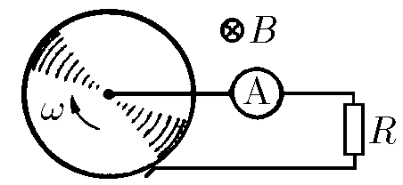

###  Условие:

$11.1.25^*.$ Проводящий диск вращается с угловой скоростью $\omega$ в однородном магнитном поле индукции $B$, перпендикулярном плоскости диска. Что покажет амперметр, включенный через сопротивление $R$? Найдите ток, если $R = 1 \,Ом$, радиус диска $r = 0.05 \,м$, $\omega = 2\pi\cdot 50 \,рад/с$, $B = 1 \,Тл$.

###  Решение:

Вычислим ЭДС индукции между центром диска $O$ и скользящим контактом $A$, воспользовавшись определением ЭДС:

$$
{E}_{i} = \frac{A_{ст}}{q}
$$

где $A_{ст}$ — работа сторонних сил (в данном случае это сила Лоренца) при перемещении положительного заряда из точки $A$ в точку $O$

Обозначим через $x$ — расстояние от заряда до центра $O$. Сила Лоренца, действующая на заряд:

$$
F_{л} = qvB = q \omega xB ( \alpha = 90^{ \circ})
$$

Работа силы Лоренца:

$$
A_{ст} = \int_{0}^{r} F_{л} dx = \int_{r}^{0} q \omega xB dx
$$

$$
A = q \omega B \int_{0}^{r} xdx = \frac{1}{2} q \omega r^{2} B
$$

может быть вычислена так же элементарно с помощью разбиения отрезка $AO$ на малые участки

$$
\Delta x_{i} = x_{i+1} - x_{i}
$$

вычисления работы на каждом участке

$$
A_{i} = q \omega B \frac{x_{i+1} + x_{i}}{2} (x_{i+1} - x_{i})
$$

и суммирования:

$$
A_{} = \sum A_{i} = \sum q \omega B \frac{x_{i+1}^{2} - x_{i}^{2}}{2} = \frac{1}{2} q \omega B r^{2}
$$

Получаем, подставляя:

$$
\varepsilon_{i}= \frac{1}{2} \omega Br^{2}
$$

Согласно закону Ома для полной цепи:

$$
I = \frac{ \varepsilon_{i}}{R} = \frac{ \omega Br^{2}}{2R}
$$

####  Ответ: $I = \omega Br^2/(2R) = 0.4 \,А$