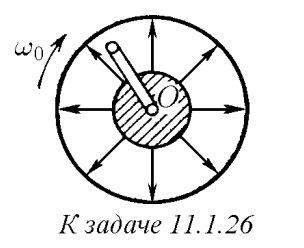
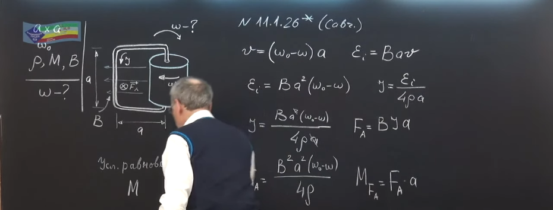
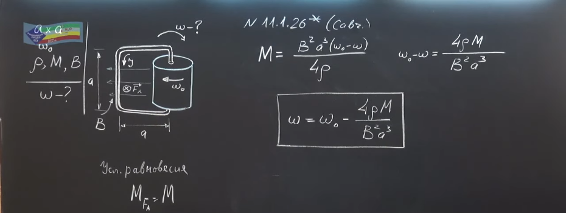

###  Условие: 

$11.1.26^{∗}.$ На оси $O$ шарнирно закреплена одной стороной квадратная проволочная рамка, размеры которой $a × a$. Вокруг этой же оси вращается с угловой скоростью $\omega_0$ магнит, создающий в области, где расположена рамка, радиальное магнитное поле. Определите угловую скорость рамки, если сопротивление единицы ее длины $\rho$, момент силы трения $M$, а индукция магнитного поля у свободного края рамки $B$. 

 

###  Решение: 

 

 

 

###  Ответ: $ \omega = \omega_0 − 4M\rho /(a^3B^2)$ 
