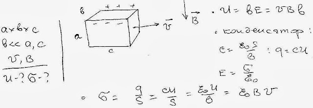

###  Условие: 

$11.1.3.$ Металлический брусок, размеры которого $a×b×c$ ($b \ll a, c$), движется со скоростью $v$ в магнитном поле индукции $B$ так, как показано на рисунке. Найдите разность потенциалов между боковыми сторонами бруска и поверхностную плотность зарядов на них. 

###  Решение: 

 

###  Ответ: $V = vbB;$ $\sigma = \varepsilon_0vB$ 
