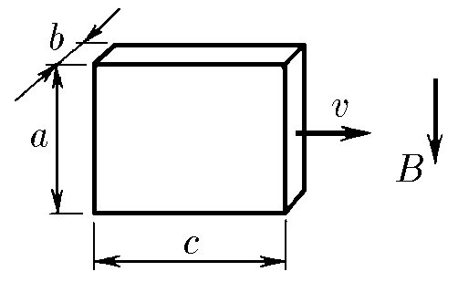

###  Условие: 

$11.1.3.$ Металлический брусок, размеры которого $a×b×c$ ($b \ll a, c$), движется со скоростью $v$ в магнитном поле индукции $B$ так, как показано на рисунке. Найдите разность потенциалов между боковыми сторонами бруска и поверхностную плотность зарядов на них. 

###  Решение: 

Как мы показали в [11.1.2](/ru/11.1.2), когда металлический брусок движется со скоростью \(v\) в магнитном поле \(B\), в нём возникает электромагнитная индукция. Электрическое поле, индуцированное внутри бруска, равно:

$$
E = vB \quad (1)
$$

Разность потенциалов между боковыми сторонами бруска можно найти через это электрическое поле:

$$
U=bE=vBb\quad(2)
$$

Так как \(b \ll a, c\), металлический брусок можно рассматривать как плоский конденсатор. Его ёмкость выражается через площадь боковой поверхности \(S = a \cdot c\):

$$
C = \frac{\varepsilon_0S}{b}\quad(3)
$$

Используем определение заряда через ёмкость и напряжение:

$$
q = CU\quad(4)
$$

Находим $\sigma$ по определению поверхностной плотности заряда, разделив заряд $q$ на площадь боковой поверхности металлического бруска $a\times c$

$$
\sigma = \frac{q}{S} = \frac{CU}{S}=\frac{\varepsilon_0U}{b}\quad(5)
$$

Электрическое поле внутри бруска также можно выразить через поверхностную плотность заряда \(\sigma\):

$$
E=\frac{\sigma}{\varepsilon_0}=\frac{U}{b}\quad(6)
$$

Подставляя \(\sigma = \varepsilon_0 E\) из $(6)$ в $(1)$, получаем:

$$
\sigma = \varepsilon_0 E = \varepsilon_0vB\quad(7)
$$

Приравнивания $(1)$ и $(6)$ получаем

$$
E=\frac{U}{b}=vB\Rightarrow\boxed{ U=vbB}\quad(8)
$$

###  Ответ: 

$$V = vbB;\quad\sigma = \varepsilon_0vB$$ 