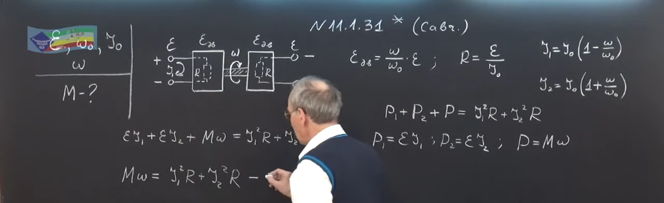
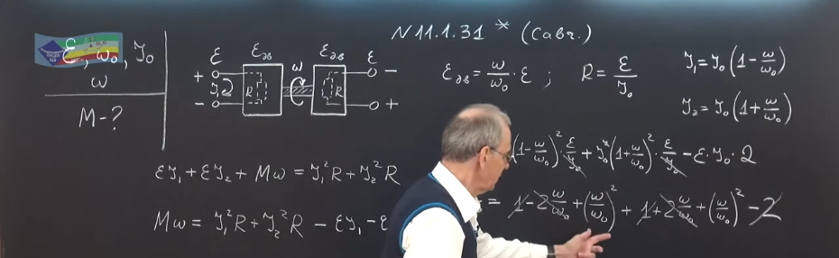
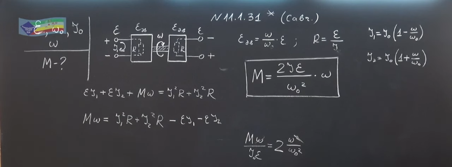

###  Условие:

$11.1.31^{∗}.$ Якоря двух одинаковых электродвигателей постоянного тока соосны и жестко соединены друг с другом. К обмоткам якорей подключены одинаковые источники тока с ЭДС $\varepsilon $. При этом угловая скорость вращения якорей без нагрузки равна $\omega_0$. Если двигатели затормозить, то ток в якорях будет равен $I_0$. Один из источников переключили так, что вращающие моменты двигателей стали противоположны. Какой момент нужно приложить к соединенным якорям для того, чтобы они вращались с заданной угловой скоростью $\omega$? Трение в двигателях пренебрежимо мало, магнитное поле статора создается постоянным магнитом.

###  Решение:

#### Ответ: $M = 2 \varepsilon I_0\omega /\omega^2_0$