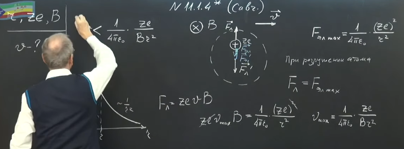
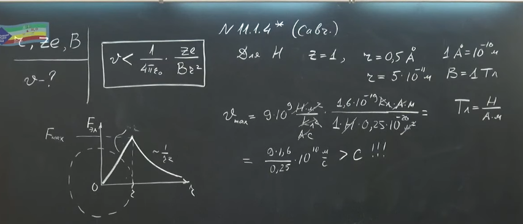

###  Условие:

$11.1.4^{∗}.$ Предположим, что атом можно представить как шар радиуса $r$ с равномерно распределенным отрицательным зарядом, в центре которого находится точечное ядро с положительным зарядом $Ze$. Найдите, с какой скоростью может, не распадаясь, двигаться такой атом поперек магнитного поля с индукцией $B$.

###  Решение:

#### Ответ: $v < Ze/(4\pi\varepsilon_0Br^2)$