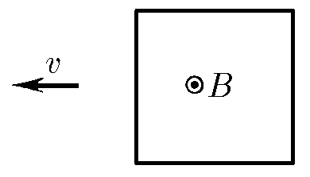

###  Условие: 

$11.1.6.$ Магнитная индукция $B$ перпендикулярна плоскости проволочной квадратной рамки. Найдите распределение напряженности электрического поля вдоль провода рамки, если она движется поперек поля с постоянной скоростью $v$. 

###  Решение: 

Скорость изменения магнитного потока составляет 

$$
\frac{d\Phi}{dt} = - B \cdot \ell \cdot v
$$

ЭДС самоиндукции распределена вдоль длины проволоки и равна

$$
\varepsilon = E\ell
$$

Из закона Фарадея мы знаем, что:

$$
\varepsilon = - \frac{d\Phi}{dt} = B \cdot \ell \cdot v
$$

Откуда, напряженность электрического поля вдоль провода рамки

$$
E = vB
$$ 

###  Ответ: $E = vB$ 
