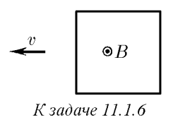
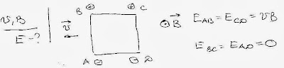

###  Условие: 

$11.1.6.$ Магнитная индукция $B$ перпендикулярна плоскости проволочной квадратной рамки. Найдите распределение напряженности электрического поля вдоль провода рамки, если она движется поперек поля с постоянной скоростью $v$. 

 

###  Решение: 

 

###  Ответ: $E = vB$ 
