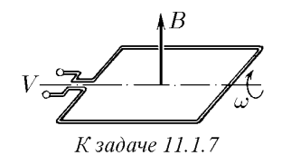

###  Условие: 

$11.1.7.$ Индукция постоянного магнитного поля измеряется с помощью квадратной рамки, размеры которой $a × a$, вращающейся с угловой скоростью $\omega$. Ось ее вращения перпендикулярна направлению магнитного поля. Амплитуда электрического напряжения, снимаемого с рамки, равна $V$. Найдите индукцию магнитного поля$^{*)}$ 

 

###  Решение: 

$\varepsilon_i = - {\Phi}'$ $\Phi = BS \, \cos\alpha$$=BS \, \cos (\omega t)$ $\varepsilon_i = - {BS \, \cos (\omega t)}'$$=BS \, sin (\omega t)$ $V=BS\omega$ $B=\frac{V}{S\omega}$$=\frac{V}{a^2\omega}$ Подставляя получаем: $V < 7 \,МВ$ 

###  Ответ: $B = V /(a^2\omega )$ 
