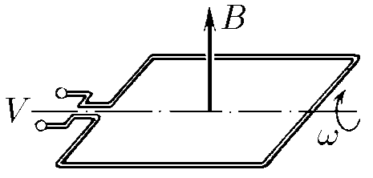

###  Условие: 

$11.1.7.$ Индукция постоянного магнитного поля измеряется с помощью квадратной рамки, размеры которой $a × a$, вращающейся с угловой скоростью $\omega$. Ось ее вращения перпендикулярна направлению магнитного поля. Амплитуда электрического напряжения, снимаемого с рамки, равна $V$. Найдите индукцию магнитного поля$^{*)}$ 

###  Решение: 

Магнитный поток, проходящий через квадратную рамку, повёрнутую на угол $\alpha=\omega t$

$$
\Phi = BS \cdot \cos\alpha = BS \cdot \cos \omega t
$$

ЭДС самоиндукции, возникающей во вращающейся квадратной рамки

$$
\varepsilon_i = - \frac{d\Phi}{dt} = - {BS \cdot \frac{d}{dt}\left(\cos \omega t\right)}
$$

Откуда, находим ЭДС самоиндукции

$$
\varepsilon_i = BS\omega \cdot \sin \omega t
$$

Откуда амплитуда ЭДС самоиндукции составляет

$$
V=BS\omega
$$

Выражаем индукцию магнитного поля

$$
B=\frac{V}{S\omega}=\frac{V}{a^2\omega}
$$ 

###  Ответ: $B = V /(a^2\omega )$ 
