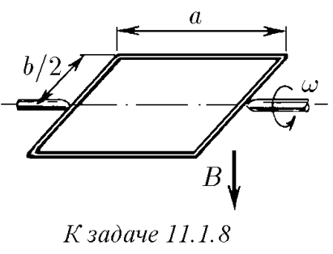
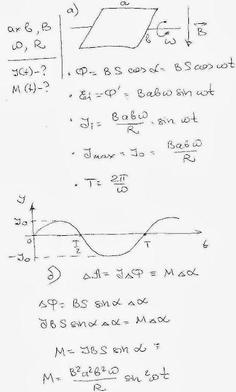
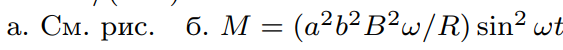
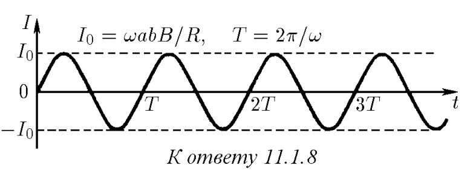

###  Условие: 

$11.1.8.$ Прямоугольная рамка, размеры которой $a×b$, помещена в магнитное поле индукции $B$, причем в начальный момент времени плоскость рамки перпендикулярна линиям поля. Рамка вращается с угловой скоростью $\omega$. а. Постройте график зависимости тока, текущего в рамке, от времени. Сопротивление рамки $R$. б. Как зависит от времени момент сил, необходимый для поддержания постоянной скорости вращения рамки? 

 

###  Решение: 

 

###  Ответ: 

 

 
