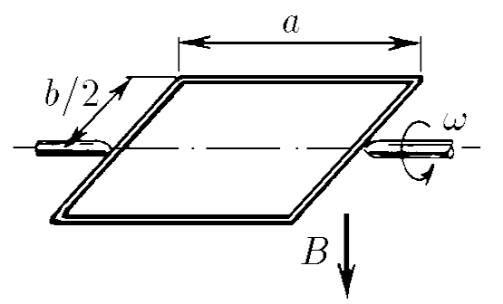
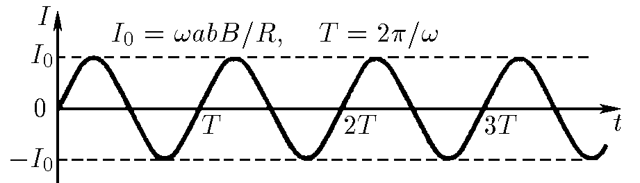

###  Условие: 

$11.1.8.$ Прямоугольная рамка, размеры которой $a\times b$, помещена в магнитное поле индукции $B$, причем в начальный момент времени плоскость рамки перпендикулярна линиям поля. Рамка вращается с угловой скоростью $\omega$. 
а. Постройте график зависимости тока, текущего в рамке, от времени. Сопротивление рамки $R$. 
б. Как зависит от времени момент сил, необходимый для поддержания постоянной скорости вращения рамки? 

###  Решение: 

а) Магнитный поток, проходящий через квадратную рамку, повёрнутую на угол $\alpha=\omega t$

$$
\Phi = BS \cdot \cos\alpha = Bab \cdot \cos \omega t
$$

ЭДС самоиндукции, возникающей во вращающейся квадратной рамки

$$
\varepsilon_i = - \frac{d\Phi}{dt} = - {Bab \cdot \frac{d}{dt}\left(\cos \omega t\right)}
$$

Откуда, находим ЭДС самоиндукции

$$
\varepsilon_i = Bab\omega \cdot \sin \omega t
$$

Из закона Ома, возникающая сила тока составляет

$$
I_i =  \frac{\varepsilon_i}{R} = \frac{Bab\omega}{R} \cdot \sin \omega t
$$

Откуда амплитуда силы тока составляет

$$
I_\text{max} = I_0 = \frac{Bab\omega}{R}
$$

Т.к. цикловая чистота вращения составляет $\omega$, то угловая частота колебаний силы тока также $\omega$, а период колебаний составляет

$$
T = \frac{2\pi}{\omega}
$$

б) Работа по закону Ампера:

$$
dA = I \Delta \Phi = M~ d \alpha
$$

где $d\alpha$ — изменение угла поворота рамки.

Изменение магнитного потока:

$$
d \Phi = BS\sin\alpha~d\alpha
$$

Связь момента и силы тока:

$$
I BS\sin\alpha~d\alpha=M~d\alpha 
$$

откуда:

$$
M=IBS\sin\alpha 
$$

Выражение для момента: Подставляем $I = \frac{Bab\omega}{R} \cdot \sin \omega t$

$$
\boxed{M=\frac{B^{2}a^{2}b^{2}\omega}{R}\sin^2\omega t}
$$

Это периодическая функция с удвоенной частотой \( 2\omega \) относительно силы тока, так как:
$$
\sin^2(\omega t) = \frac{1 - \cos(2\omega t)}{2}.
$$
   
###  Ответ: 

$$
\text{a. См. рис. }\quad\mathrm{б.~}M=(a^2b^2B^2\omega/R)\sin^2\omega t
$$

