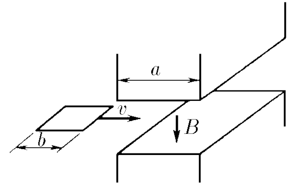
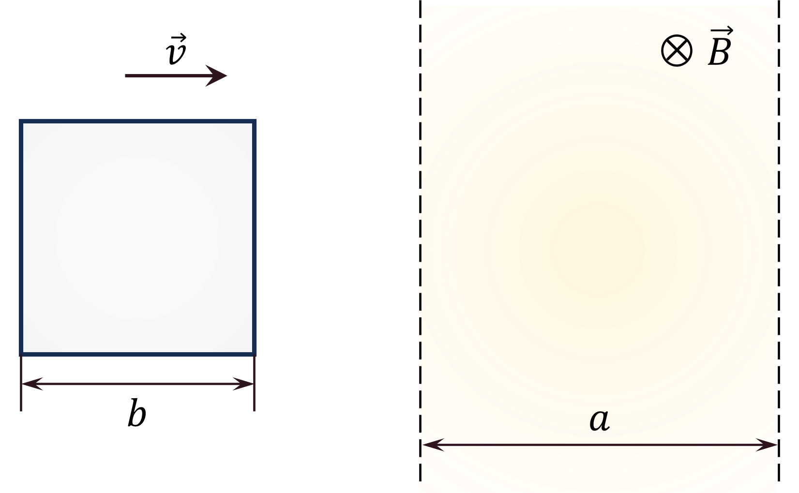

###  Условие:

$11.1.9.$ Квадратный замкнутый виток проволоки, длина стороны которого $b$, а сопротивление единицы длины $\rho$, проходит с постоянной скоростью $v$ зазор электромагнита. Магнитное поле в зазоре однородное, его индукция равна $B$. Считая поле вне этого зазора равным нулю, определите энергию, превратившуюся в тепло, для случаев, когда протяженность зазора $a$ в направлении движения витка меньше $b$ и больше $b$, а в перпендикулярном направлении — больше $b$.

###  Решение:

__Случай, когда $a>b$__

Магнитный поток, проходящий через площадь пересечения $S(t)$, зависяющую от времени $t$

$$
\Phi(t) = B \cdot S(t) = Bbvt
$$

Изменения магнитного потока за единицу времени

$$
\frac{d\Phi}{dt} = Bbv
$$

Возникающая ЭДС самоиндукции

$$
\varepsilon_i = \left |- \frac{d\Phi}{dt} \right | = Bbv
$$

Из закона Ома, возникающая сила тока составляет

$$
I_i =  \frac{\varepsilon_i}{R} = \frac{Bbv}{R} = \frac{Bv}{4\rho}
$$

При этом энергия выделяющаяся на проводе длинной $b$

$$
Q_0 = I^2Rt = \frac{B^2vb^2}{4\rho}{,}\quad t=\frac{b}{v}
$$

Учитывая, что энергия выделяется, только провода, перпендикулярные к направлению вектора скорости $\vec{v}$ и будет выделяться на данных двух проводах

$$
Q_1 = 2Q_0 = \frac{B^2vb^2}{2\rho}
$$

__Случай, когда $a<b$__

Магнитный поток, проходящий через площадь пересечения $S(t)$, зависяющую от времени $t$

$$
\Phi(t) = B \cdot S(t) = Bbvt
$$

Изменения магнитного потока за единицу времени

$$
\frac{d\Phi}{dt} = Bbv
$$

Возникающая ЭДС самоиндукции

$$
\varepsilon_i = \left |- \frac{d\Phi}{dt} \right | = Bbv
$$

Из закона Ома, возникающая сила тока составляет

$$
I_i =  \frac{\varepsilon_i}{R} = \frac{Bbv}{R} = \frac{Bv}{4\rho}
$$

При этом энергия выделяющаяся на проводе длинной $b$

$$
Q_0 = I^2Rt = \frac{B^2vab}{4\rho}{,}\quad t=\frac{a}{v}
$$

Учитывая, что энергия выделяется, только провода, перпендикулярные к направлению вектора скорости $\vec{v}$ и будет выделяться на данных двух проводах

$$
Q_2 = 2Q_0 = \frac{B^2vab}{2\rho}
$$

###  Ответ:

$$
W=B^{2}vab/(2\rho),a<b;\quad W=B^{2}vb^{2}/(2\rho),a>b
$$