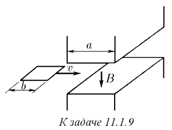
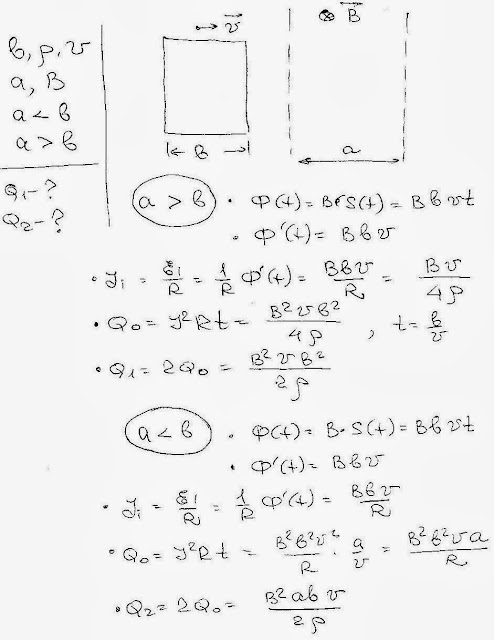
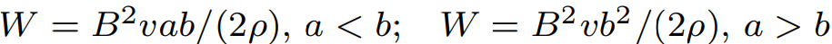

###  Условие: 

$11.1.9.$ Квадратный замкнутый виток проволоки, длина стороны которого $b$, а сопротивление единицы длины $\rho$, проходит с постоянной скоростью $v$ зазор электромагнита. Магнитное поле в зазоре однородное, его индукция равна $B$. Считая поле вне этого зазора равным нулю, определите энергию, превратившуюся в тепло, для случаев, когда протяженность зазора $a$ в направлении движения витка меньше $b$ и больше $b$, а в перпендикулярном направлении — больше $b$. 

 

###  Решение: 

 

###  Ответ: 

 
