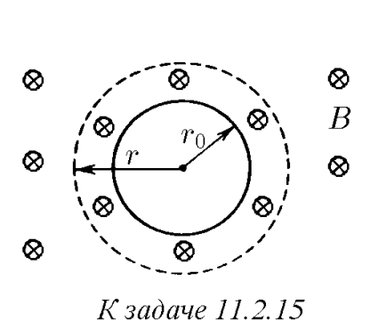
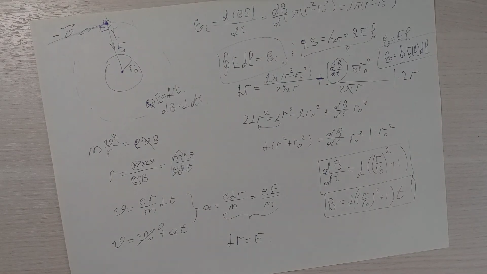

###  Условие: 

$11.2.15^{∗}.$ . Вне цилиндра радиуса $r_0$ индукция однородного магнитного поля нарастает линейно во времени: $B = \alpha t$. Как должна меняться во времени индукция однородного магнитного поля внутри цилиндра, чтобы электрон двигался по окружности радиуса $r > r_0$? При $t = 0$ электрон покоится. 

 

###  Решение: 

 

 

###  Ответ: $B(t) = \alpha t(1 + r^2/{r_0}^2)$ 

### 
