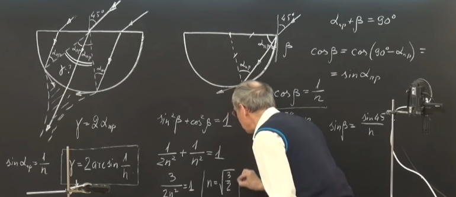
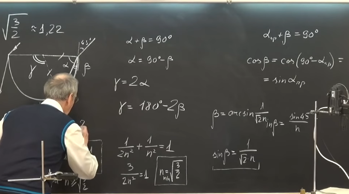
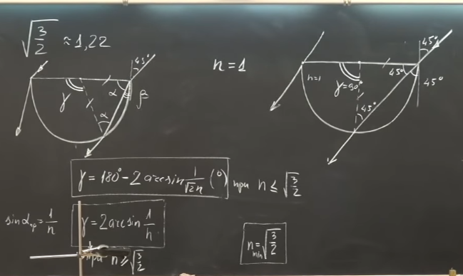

###  Условие:

$13.2.20^{∗}.$ На плоскую поверхность стеклянного полуцилиндра падают под углом $45^{\circ}$ световые лучи, лежащие в плоскости, перпендикулярной оси цилиндра. Из какой части боковой поверхности полуцилиндра будут выходить лучи света? Показатель преломления стекла $n$.

###  Решение:

#### Ответ: Из части боковой поверхности полуцилиндра, ограниченной углом $ \alpha = 2\,\arcsin (1/n).$