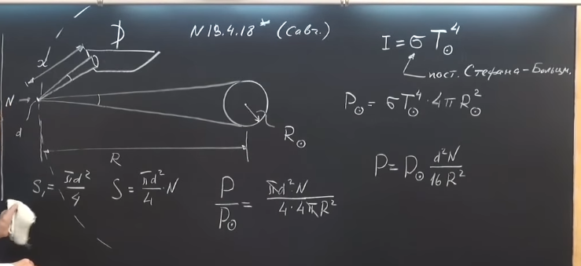
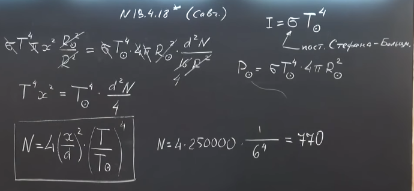
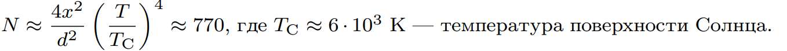

###  Условие: 

$13.4.18^{∗}.$ По известной легенде жители Сиракуз под руководством Архимеда сожгли корабли римского флота, фокусируя на них свет Солнца с помощью плоских зеркальных щитов. Принимая, что диаметр щита $d = 1\,м$, расстояние до кораблей $x = 500\,м$ и температура, при которой загорается дерево, $T \approx 1000\,К$, оцените необходимое число щитов. 

###  Решение: 

 

 

 

###  Ответ: 

 
