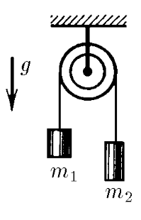
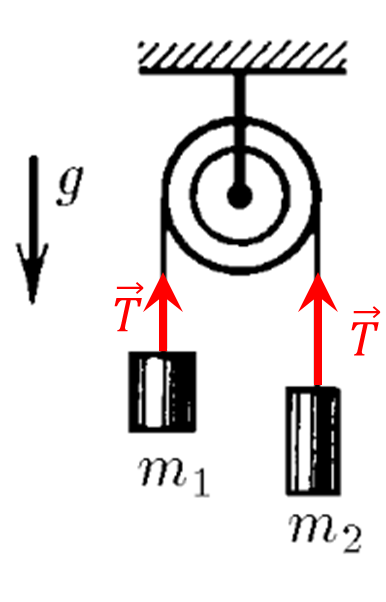

###  Условие:

$2.1.11.$ Найдите ускорение грузов и силы натяжения нитей в системе, изображенной на рисунке. Блок и нити невесомы, трения нет.

###  Решение:

  Силы действующие на грузы

Запишем второй закон Ньютона для вертикальной оси

$$
\left\\{\begin{matrix} m_1a = T - m_1g\\\ m_2a = m_2g - T \end{matrix}\right.
$$

Отсюда выражаем ускорение, которое будет одинаково для обоих грузов в силу нерастяжимости нити

$$
\fbox{$a = g\frac{m_2-m_1}{m_2+m_1}$}
$$

Подставляем в систему уравнений и находим силу натяжения нити $T$

$$
\fbox{$T = \frac{2m_1m_2g}{m_1+m_2}$}
$$

####  Ответ:

$$
a = g\frac{m_2-m_1}{m_2+m_1}
$$

$$
T = \frac{2m_1m_2g}{m_1+m_2}
$$