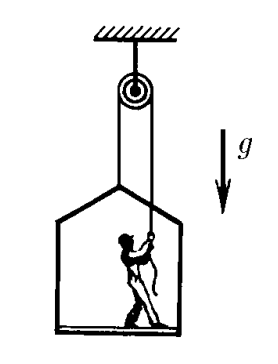

###  Условие:

$2.1.12.$ Маляр работает в подвесной люльке. Ему понадобилось срочно подняться вверх. Он принимается тянуть за веревку с такой силой, что сила его давления на пол люльки уменьшилась до $400 \,H$. Масса люльки $12 \,кг$, масса маляра $72 \,кг$. Чему равно ускорение люльки?

###  Решение:

  Маляр на подвесной люльке

Обозначим массу маляра через $M_1$, а массу кресла через $M_2$. Запишем уравнения движения маляра и кресла:

$$
\left\\{\begin{matrix} M_{1}a = T - M_{1}g + P & \\\ M_{2}a = T - M_{2}g - P & \end{matrix}\right.
$$

где $P$ -сила давления маляра на кресло.

Вычитая нижнее уравнение из верхнего, находим

$$
a = \frac{2P - (M_{1} - M_{2})g}{M_{1} - M_{2} } = \frac{1}{3}g
$$

Складывая затем уравнения движения, находим

$$
2T = (M_{2} + M_{2}) (a+g) = \frac{4}{3}(M_{1} + M_{2})g = 1.1 \cdot 10^3 \,Н
$$

Это и есть полная нагрузка на блок:

$$
N = 2T = 1.1 \cdot 10^3 \,Н
$$

####  Ответ:

$$
a = 3.5 \,м/с^2
$$

$$
T \approx 1.1 \cdot 10^3 \,Н
$$