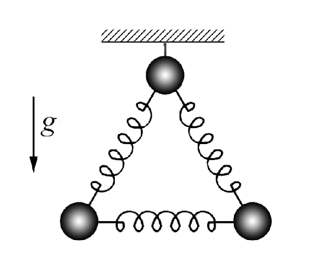
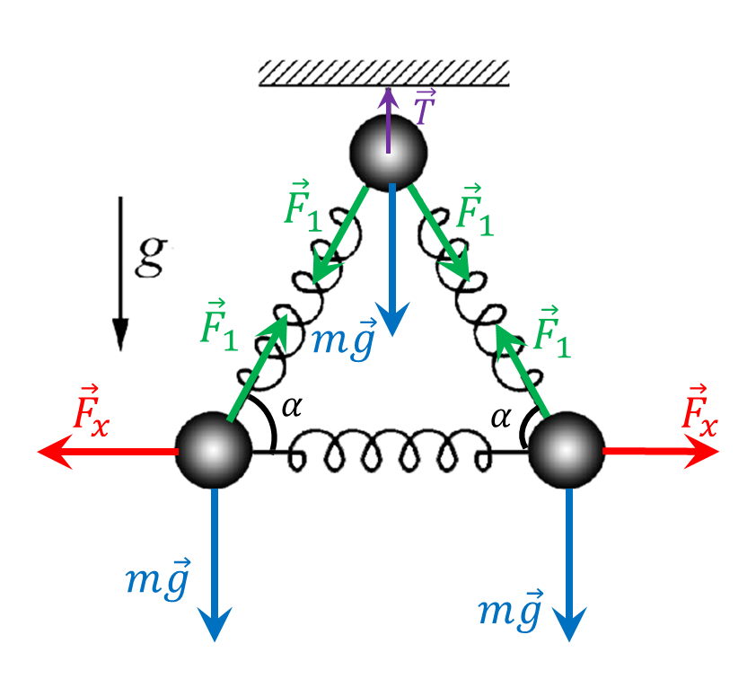
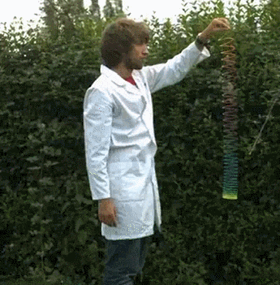

###  Условие: 

$2.1.13.$ Система из трех одинаковых шаров, связанных одинаковыми пружинами, подвешена на нити. Нить пережигают. Найдите ускорения шаров сразу после пережигания нити. 

###  Решение: 

  Силы действующие на систему 

Запишем условие равновесия для двух нижных шаров на вертикальную и горизонтальную оси $$ \left\\{\begin{matrix} mg = F_1 \sin\alpha\\\ F_x = F_1 \cos\alpha& \end{matrix}\right.$$ где $P$ -сила давления маляра на кресло. 

И для верхнего шарика $$T = mg + 2F_1 \sin\alpha$$ $$T = 3mg$$ Соответственно, когда нить перегорит, на верхний шарик будет вниз действовать сила $T=3mg$. Из второго закона Ньютона его начальное ускорение найдем как $$a = \frac{T}{m} = 3g$$ На нижние шарики, в горизонтальном направлении будут действовать сила $F_x$, которая будет компенсироваться силой $F_1 \cos\alpha$, а сила тяжести $mg$ — $F_1 \sin\alpha$ 

Таким образом, нижние шарики будут находиться в невесомости $$a=0$$ NO: Чем-то похожее явление происходит при падении "Слинки" 

  Падение слинки 

Советую интересную задачу про слинки [IPhO 2019 "Springs and Slinky"](https://s3.eu-central-1.amazonaws.com/physprob.com/files/ipho/2019_Israel_p1.pdf)

###  Ответ: 

Ускорение верхнего шара равно $3g$, ускорение нижних — нулю. 

###  Альтернативное решение: 

   

