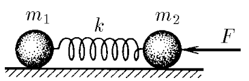
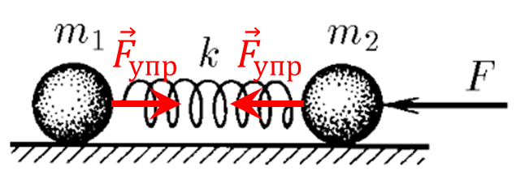

###  Условие: 

$2.1.14.$ Тела массы $m_1$ и $m_2$ соединены пружиной жесткости $k$. На тело массы $m_2$ действует постоянная сила $F$, направленная вдоль пружины к телу массы $m_1$. Найдите, на сколько сжата пружина, если никаких других внешних сил нет, а колебания уже прекратились. Каким будет ускорение тел сразу же после прекращения действия силы $F$? 

###  Решение: 

  Силы действующие на систему 

Когда колебания уже прекратились, шарики движутся с одинаковым ускорением $a$. 

Запишем второй закон Ньютона $$ \left\\{\begin{matrix} m_1a_1 = -k\Delta x \\\ m_2a_2 = -F + k\Delta x \end{matrix}\right.$$ Сократим на $a$ $$\frac{m_1}{m_2} = \frac{-k\Delta x}{-F + k\Delta x}$$ Выражаем $\Delta x$ $$\boxed{\Delta x = \frac{F}{k} \frac{m_1}{m_1+m_2}}$$ Сразу после прекращения действия силы на тела будет действовать сила упругости $k \Delta x$, которая и будет вызывать ускорение $$ \left\\{\begin{matrix} m_1a_1 = -k\Delta x \\\ m_2a_2 = k\Delta x \end{matrix}\right.$$ Откуда выражаем $a_1$ $$\boxed{a_1 = -\frac{F}{m_{2}+m_{1}}}$$ И аналогично $a_2$ $$\boxed{a_1 = \frac{Fm_{1}}{m_{2}(m_{1}+m_{2})}}$$ 

###  Ответ: 

$$x=-\frac{Fm_{1}}{k(m_{1}+m_{2})}$$ $$a_{1}=-\frac{F}{m_{2}+m_{1}}$$ $$a_{2}=\frac{Fm_{1}}{m_{2}(m_{1}+m_{2})}$$ 
