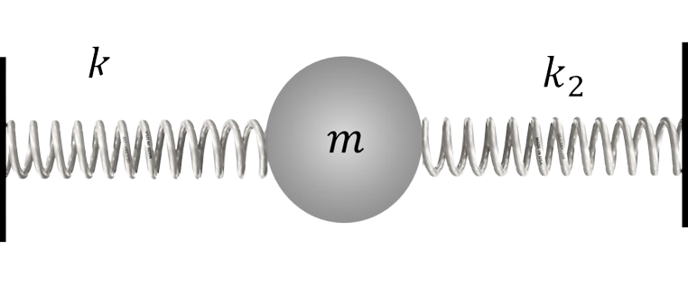
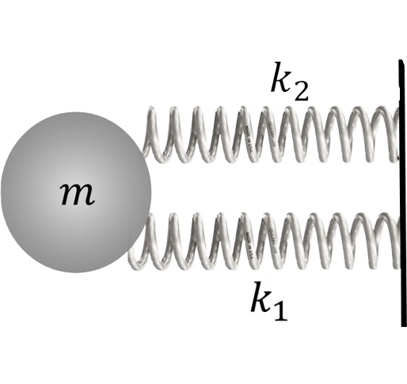

###  Условие:

$2.1.15.$ Тело массы $m$ соединено двумя пружинами жесткости $k_1$ и $k_2$ с неподвижными стенками, пружины первоначально не деформированы. При возникших колебаниях наибольшее ускорение тела равно $a$. Найдите максимальное отклонение тела от положения равновесия и максимальные силы, с которыми пружины действуют на стенки.

###  Решение:

1\. Пружины в данной задаче соединены параллельно, их деформация одинакова

$$
Δx_1 = Δx_2 = Δx
$$

2\. Сила, действующая на массу со стороны пружин. определится в виде суммы

$$
F = F + F_1
$$

, или

$$
k \Delta x = k_1 \Delta x + k_2 \Delta x
$$

3\. Запишем уравнение движения массы под действием эквивалентной пру- жины жёсткостью ко, что позволит определить максимальное смещение

$$
ma = (k_1 + k_2) \Delta x_{max}
$$

$$
\Delta x_{max} = ma/(k_1 + k_2)
$$

4\. Максимальные значения сил, действующих на массу

$$
{F_1}_{max} = k_1 \Delta x_{max}
$$

$$
{F_2}_{max} = k_2 \Delta x_{max}
$$

#### Ответ:

$$
x_{макс} = ma/(k_1 + k_2);
$$

$$
{F_1}_{макс} = k_1x_{макс}
$$

$$
{F_2}_{макс} = k_2x_{макс}
$$