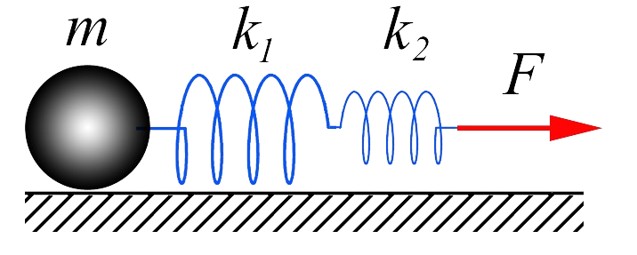
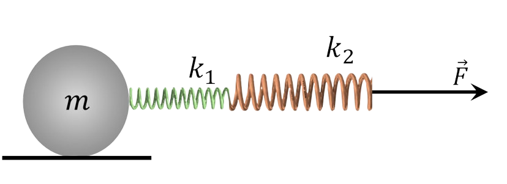

###  Условие: 

$2.1.16.$ Тело массы $m$ прикреплено к двум соединенным последовательно пружинам жесткости $k_1$ и $k_2$. К свободному концу цепочки пружин приложена постоянная сила $F$. Каково суммарное удлинение пружин, если колебания уже прекратились? 

###  Решение: 

1\. При последовательном соединении пружин их деформация будет разной при одинаковой действующей силе, это обстоятельство позволяет определить общую жёсткость пружин следующим образом $$\Delta x_0 = \Delta x_1 + \Delta x_2 = \frac{F}{k_1}+\frac{F}{k_2} = \frac{F}{k_0}$$ $$\boxed{k_0 = \frac{k_1 k_2}{k_1 + k_2}}$$ 2\. Совместное действие на массу пружин при покоящейся массе будет равно приложенной силе $F$ $$k_0 \Delta x_0 = F$$ $$\boxed{ \Delta x_0 = \frac{F(k_1 + k_2)}{k_1 k_2}}$$ 

###  Ответ: 

$$x = F(k_1 + k_2)/(k_1k_2).$$ 
