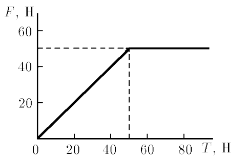

###  Условие: 

$2.1.18.$ Тело, находящееся на горизонтальной плоскости, тянут за нить в горизонтальном направлении. Нарисуйте график зависимости силы трения, действующей на тело со стороны плоскости, от силы натяжения нити. Первоначально тело неподвижно. Масса тела $10 \,кг$, коэффициент трения $0.51$. 

###  Решение: 

1\. Если к телу прикладывают горизонтальную силу, а они вопреки стараниям не движется, то естественно предположить, что этому, что то препятствует. И этим «что-то» является сила трения покоя, равная по величине прикладываемой силе. Величина силы трения покоя может меняться в зависимости от величины прило- женной силы. Наибольшее значение силы трения, при котором ещё не наступает скольжение, определится как: $$F_{тp(max)} = \mu N = \mu mg = 51 \,H$$ 2\. Сила трения покоя, как и всякая приличная сила, имеет направление, она направлена в сторону возможного (виртуального) перемещения, причём при нулевой внешней силе, сила трения тоже будет равна нулю. Таким образом, сила трения покоя линейно меняется от нуля до максимального значения, оставаясь далее постоянной. Внешняя сила начинает сообщать телу ускорение. 
