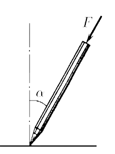
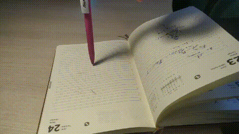
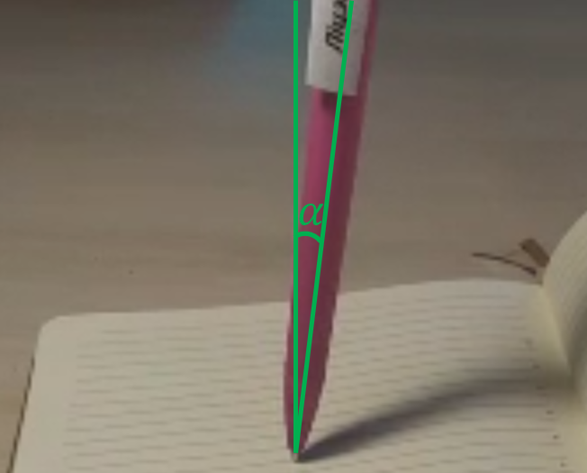
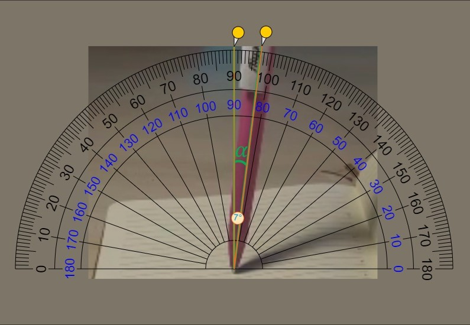
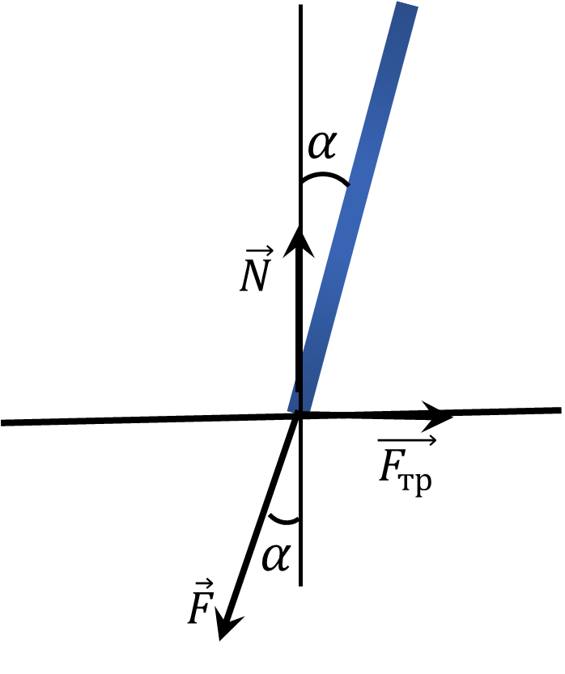

###  Условие: 

$2.1.19.$ Если нажимать пальцем на шариковую ручку, опирающуюся на твердую поверхность, одновременно наклоняя ее, то, пока ручка образует малый угол с перпендикуляром к поверхности, она будет послушно следовать за пальцем руки. Как только угол наклона ручки превысит некоторое максимальное значение $\alpha_{max}$, она выскользнет из-под пальца, как бы сильно или слабо ни нажимать на нее. Поэкспериментируйте сами и оцените коэффициент трения между шариком ручки и поверхностью, на которую она опирается. 

###  Решение: 

Проведём наглядный экспиремент, поставь ручку на лист бумаги и будем медленно отводить в сторону 

  

В некоторый момент ручка уйдет в противоположную сторону и выскальзывает из под руки 

  

С помощью специальной программы, определим угол наклона ручки в этот момент 

  

Получилось $$\boxed{\alpha = 7^{\circ}}$$ Отобразим силы действующие на ручку 

  

Т.к. сила трения является силой трения покоя $$F_{тр} = \mu N$$ Запишем условие равновесия в критический момент $$\left\\{\begin{matrix} \mu N = F \sin\alpha\\\ N = F \cos\alpha \end{matrix}\right.$$ Откуда $$\boxed{\mu = \tan\alpha}$$ Подставляем эксперементальные данные $$\mu = \tan 7^{\circ} = 0.12$$ 
