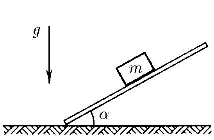
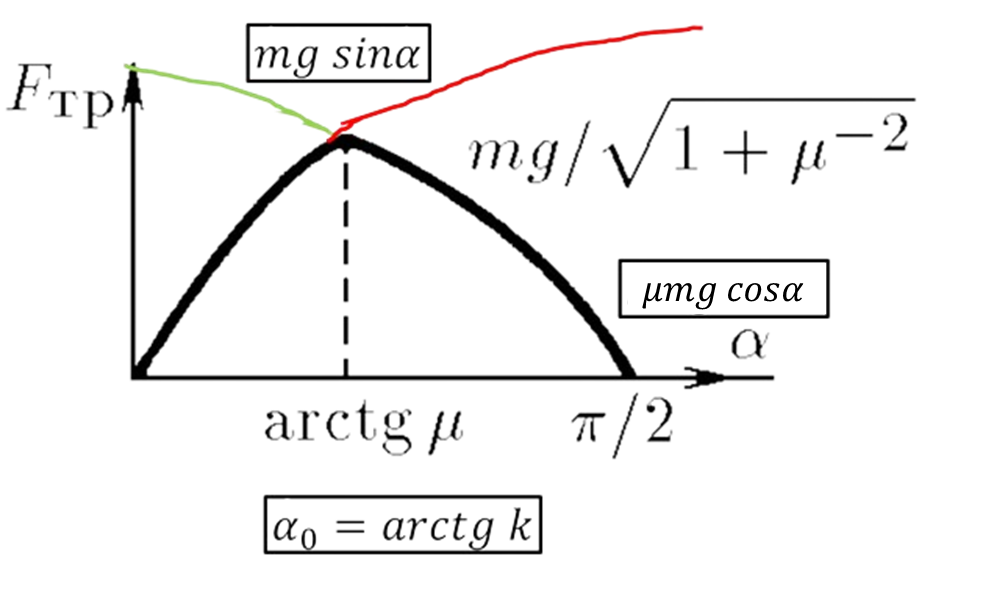

###  Условие:

$2.1.20.$ На горизонтальной доске лежит брусок массы $m$. Доску медленно наклоняют. Определите зависимость силы трения, действующей на брусок, от угла наклона доски $\alpha$. Коэффициент трения $\mu$.

###  Решение:

1\. Сила трения по модулю не может превышать значения $F_{тр(шах)} = \mu N$, где $N$ — сумма проекций всех сил на направление перпендикулярное возможному перемещению. При равновесии же тела сила трения равна сумме проекций сил на направление движения. Таким образом, в состоянии покоя

$$
F_{тр} = mg \sin\alpha
$$

2\. В противном случае, при $\mu\geq \tan\alpha $

$$
F_{тр} = \mu mg \cos\alpha
$$

3\. Максимальное значение силы трения будет иметь место при угле $\alpha_0$

$$
\boxed{\alpha_0 = \arctan \mu}
$$

###  Ответ:

$$
F_{тр} = mg \sin\alpha\text{ при }\tan\alpha\leq \mu
$$

$$
F_{тр} = \mu mg \cos\alpha\text{ при }\tan\alpha\geq \mu
$$