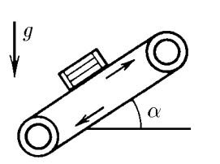
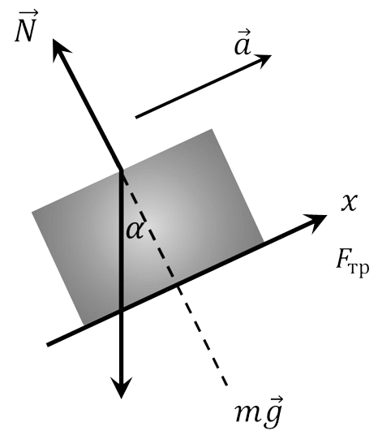

###  Условие: 

$2.1.21.$ Ленточный подъемник образует угол $\alpha$ с горизонтом. С каким максимальным ускорением может подниматься ящик на таком подъемнике, если коэффициент трения равен $\mu$? Лента не прогибается. 

###  Решение: 

  Силы действующие на ящик 

1\. Отбросив наложенные на ящик связи, и заменив их реакциями, можно рассматривать его как свободное тело, способное перемещаться вдоль оси $ОХ$. Сила трения в данном случае направлена в сторону ускорения, т.е. против возможного перемещения ящика. 

2\. Уравнение второго закона Ньютона позволяет определить максимальное значение ускорения $$\mu mg \cos\alpha -mg sın \alpha\leq ma$$ $$\boxed{a \leq g (\mu\cos\alpha -\sin\alpha )}$$ 

###  Ответ: 

$$a_{макс} = g(\mu\cos\alpha − \sin\alpha )$$ 
