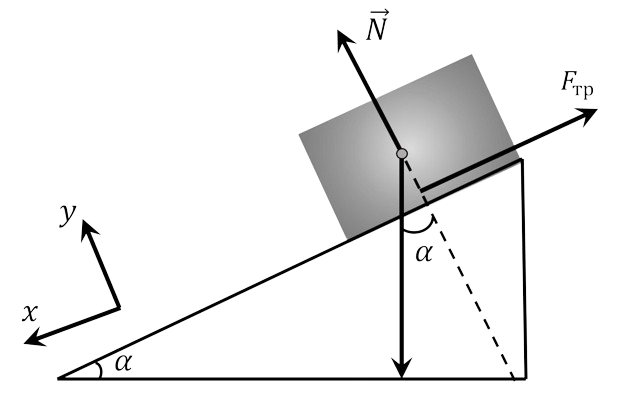

###  Условие:

$2.1.22.$ Через какое время скорость тела, которому сообщили вверх по наклонной плоскости скорость $v$, снова будет равна $v$? Коэффициент трения $\mu$, угол между плоскостью и горизонтом $\alpha$, $\tan\alpha > \mu$

###  Решение:

Тело на наклонной плоскости находится под действием трёх сил: силы тяжести $\vec{F}_{1} = m \vec{g}$, силы трения $\vec{F}_{2} = - \mu mg$ и нормальной реакции связи $\vec{N}$, однако, при дальнейшем рассмотрении движения нормальную реакцию можно не рассматривать, т.к. её проекция на горизонтальную ось, вдоль которой движется тело, равна нулю.

Уравнение второго закона Ньютона в проекции на ось ОХ при движении тела вверх в векторной форме запишется следующим образом

$$
\vec{F}_{1} + \vec{F}_{2} = m \vec{a}
$$

Определим проекции действующих сил на ось ОХ и запишем уравнение второго закона Ньютона

$$
F_{1x} = mg \sin\alpha , F_{2x} = \mu mg \cos\alpha
$$

$$
\mu mg \cos\alpha + mg \sin\alpha = ma
$$

Поделим обе части последнего уравнения на массу $m$ и выразим величину ускорения

$$
a = g( \sin\alpha + \mu\cos\alpha )
$$

Время движения тела вверх $t_1$ определится из условия равенства нулю скорости в конце подъёма

$$
0 = v_{0} - at \Rightarrow t_{1} = \frac{v_{0} }{a} = \frac{v_{0} }{g ( \sin\alpha + \mu\cos\alpha ) }
$$

Движению тела вниз соответствует уравнение

$$
mg \sin\alpha - \mu mg \cos\alpha = ma
$$

$$
a = g( \sin\alpha - \mu\cos\alpha )
$$

Скорость станет равной $v_0$ только в конце спуска, потому как закона сохранения энергии никто не отменял, поэтому

$$
\frac{dv}{dt} = g( \sin\alpha + \mu\cos\alpha )
$$

$$
\int_{0}^{v_{0} } dv = g( \sin\alpha + \mu\cos\alpha ) = \int_{0}^{t_{2} } dt
$$

$$
t_{2} = \frac{v_{0} }{g ( \sin\alpha + \mu\cos\alpha ) }
$$

Искомое время определится в виде суммы $t = t_{1} + t_{2}$

$$
\boxed{t = \frac{2v_{0} \sin\alpha}{g( \sin^{2} \alpha - \mu^{2} \cos^{2} \alpha )}}
$$

###  Ответ:

$$
t = \frac{2v_{0} \sin\alpha}{g( \sin^{2} \alpha - \mu^{2} \cos^{2} \alpha )}
$$