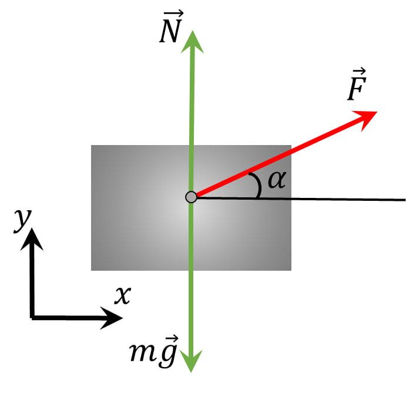

###  Условие:

$ 2.1.23.$ На тело массы $m$, лежащее на горизонтальной плоскости, действует сила $F$ под углом $\alpha$ к горизонту. Коэффициент трения $\mu$. Найдите ускорение тела, если оно не отрывается от плоскости.

###  Решение:

1\. Нормальная реакция связи в данном случае будет определяться как силой тяжести $mg$, так и проекцией на ось $OY$ приложенной силы:

$$
N=mg-F \, \sin\alpha
$$

Сила трения определится как:

$$
F_{тр} = (mg-F \,\sin\alpha )
$$

2\. Основной закон динамики, таким образом. запишется следующим образом:

$$
F \, \cos\alpha = \mu (mg-F \,\sin\alpha )
$$

3\. Из уравнения второго закона Ньютона легко определить искомое ускорение

$$
a = \frac{1}{m}(F\cos\alpha -\mu mg+F\,\sin\alpha )
$$

$$
a = \frac{F}{m}(\cos\alpha -\mu\,\sin\alpha )
$$

#### Ответ: $a = (F/m)(\cos\alpha + \mu\,\sin\varphi)$$ − \mu g$, если это выражение больше нуля, иначе $a = 0$.