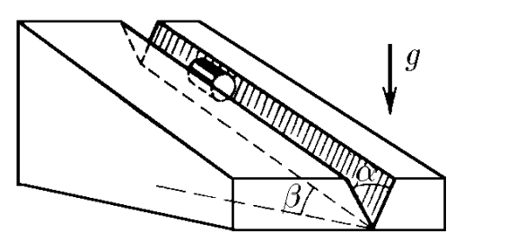
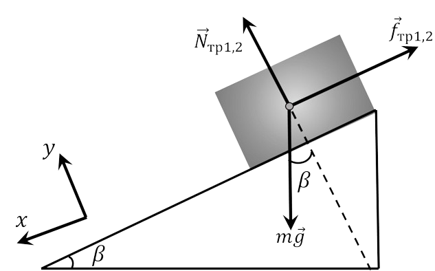
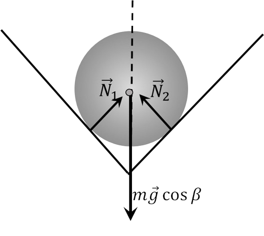

###  Условие: 

$2.1.24.$ Цилиндр скользит по желобу, имеющему вид двугранного угла с раствором $\alpha$. Ребро двугранного угла наклонено под углом $\beta$ к горизонту. Плоскости двугранного угла образуют одинаковые углы с горизонтом. Определите ускорение цилиндра. Коэффициент трения между цилиндром и поверхностью желоба $\mu$. 

###  Решение: 

Силы, действующие на цилиндр: сила тяжести $\vec{F}_{т} = m \vec{g}$ две силы нормальной реакции граней двугранного угла $\vec{N}_{1}$ и $\vec{N}_{2}$, две силы трения цилиндра о грани $\vec{f}_{тр1}$ и $\vec{f}_{тр2}$ (см. рисунки). Так как цилиндр обладает осевой симметрией и плоскости двугранного угла симметричны относительно вертикали $$| \vec{N}_{1} | = | \vec{N}_{2} | = N$$ $$\vec{f}_{тр1}| = | \vec{f}_{тр2} | = f_{тр}$$ По закону Кулона — Амонтона $f_{тр} = \mu N$. 

Основной закон динамики для цилиндра имеет вид $$m \vec{a} = m \vec{g} + \vec{N}_{1} + \vec{N}_{2} + \vec{f}_{тр1} + \vec{f}_{тр2}$$ Так как цилиндр неподвижен в плоскости сечения, перпендикулярного ребру двугранного угла. то. проектируя это уравнение на ось. перпендикулярную ребру, получим (см. рисунок б) $$2N \sin\frac{ \alpha}{2} = mg \cos\beta$$ В проекции на ребро (ось $ОХ$) уравнение динамики для цилиндра запишется, как $$ma_{x} = mg \sin\beta - 2N \mu$$ 

Подставляя сюда $N$, находим ускорение цилиндра $$a_{x} = g \left ( \sin\beta - \frac{ \mu\cos\beta}{ \sin\alpha / 2} \right )$$ 

###  Ответ: 

$$a=g\left(\operatorname{sin}\beta -\frac{\mu\operatorname{cos}\beta}{\operatorname{sin}(\alpha /2)}\right)\text{ при }\mu\leqslant\operatorname{tg}\beta\operatorname{sin}\frac{\alpha}{2};$$ $$a=0\text{ при }\mu\geqslant\operatorname{tg}\beta\operatorname{sin}\frac{\alpha}{2}.$$ 
