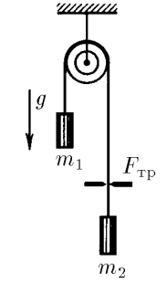
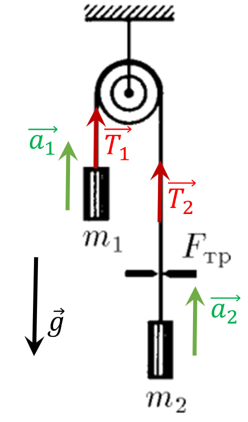

###  Условие: 

$2.1.25.$ Нить, перекинутая через блок с неподвижной осью, пропущена через щель. На концах нити подвешены грузы, масса которых $m_1$ и $m_2$. Определите ускорения грузов, если при движении нити на нее со стороны щели действует постоянная сила трения $F_{тр}$. 

###  Решение: 

1\. Ввиду невесомости и не растяжимости нити, а так же, идеальных свойств блока (отсутствие потерь и малый вес) задачу можно решать в следующем приближении) $$a_1=a_2=a$$ $$T_1=T_2=T$$ 2\. Уравнения движения грузов в проекции на вертикальную ось в данном случае записываются следующим образом: $$\left\\{\begin{matrix} m_1a = m_2g - T \\\ m_2a =T-m_2g-F_{тр} \end{matrix}\right.$$ 3\. Решая уравнения совместно, получим $$a=\frac{(m_1-m_2)g-F_{тр}}{m_1+m_2}$$ 4\. Подстановка в первое уравнение системы величины ускорения позволяет определить натяжение нити $$\boxed{T=m_1\frac{2m_2g+F_{тр}}{m_1+m_2}}$$ 

###  Ответ: 

$$T=m_1\frac{2m_2g+F_{тр}}{m_1+m_2}$$ 
