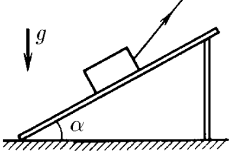

###  Условие:

$2.1.26^*.$ По деревянным сходням, образующим угол $\alpha$ с горизонтом, втаскивают за привязанную к нему веревку ящик. Коэффициент трения ящика о сходни $\mu$. Под каким углом к горизонту следует тянуть веревку, чтобы с наименьшим усилием втащить ящик?

###  Решение:

Рассмотрим силы, действующие на ящик (рис.). Это - сила тяжести $ m \vec{g} $, сила натяжения веревки $ \vec{F} $, сила реакции соударения $ \vec{N} $ и сила трения $ \vec{F}_{тр} $, величина которой $ \vec{F}_{тр} = \mu N $. Спроктируем все силы на направление вдоль схождения и перпендикулярно к ним и запишем соответственные уравнения движения.

Так как ящик не перемещается в направлении, перпендикулярном схождению, то сумма проекций сил на это направление должна быть равна нулю, то есть

\\[ N + F \sin ( \beta - \alpha ) - mg \cos\alpha = 0, \tag{1} \\]

Вдоль схождения ящик движется с ускорением $ a $ (в частном случае при равномерном движении $ a = 0 $), поэтому сумма проекций сил должна быть равна $ ma $:

\\[ F \cos( \beta - \alpha ) - mg \sin\alpha - \mu N = ma. \tag{2} \\]

Из уравнений (1) и (2) получаем:

\\[ F = \frac{ma + mg ( \sin\alpha + \mu\cos\alpha )}{ \cos ( \beta - \alpha ) + \mu\sin ( \beta - \alpha ) }. \tag{3} \\]

В полученное выражение для силы $ F $ угол $ \beta$ входит только знаменатель. Следовательно, величина силы $ F $ будет минимальной при таком значении угла $ \beta$, при котором знаменатель в формуле (3) максимален, то есть максимальна величина

\\[ \cos ( \beta - \alpha ) + \mu\sin ( \beta - \alpha ). \\]

Сделаем некоторые преобразования. Представим коэффициент трения $ \mu$ как тангенс некоторого угла $ \gamma$:

\\[ \tan\gamma = \mu ; \quad \gamma = \arctan \mu ; \\] \\[ \sin\gamma = \frac{ \mu}{ \sqrt{1 + \mu^{2} } }; \quad \cos\gamma = \frac{1}{ \sqrt{1 + \mu^{2} } }. \\]

Тогда можно записать:

\\[ \cos ( \beta - \alpha ) + \mu\sin ( \beta - \alpha ) = \sqrt{1 + \mu^{2} } \cos ( \beta - \alpha - \gamma ). \\]

Последнее выражение максимально и равно

\\[ \sqrt{1 + \mu^{2}} \quad \text{при} \quad \beta - \alpha - \gamma = 0, \quad \text{то есть при} \quad \beta = \alpha + \gamma = \alpha + \arctan \mu . \tag{4} \\]

При таком значении угла $ \beta$ и минимальна сила $ F $. Причем, если ящик движется равномерно ($ a = 0 $), то

\\[ F_{min} = \frac{mg( \sin\alpha + \mu\cos\alpha ) }{ \sqrt{1 + \mu^{2} } }. \\]

а при движении с ускорением $ a $

\\[ F_{min} = \frac{ma + mg ( \sin\alpha + \mu\cos\alpha ) }{ \sqrt{1 + \mu^{2} } }. \\]

Однако, это решение верно не для любого ускорения. Так как направление силы $ \vec{F} $ не зависит от $a$, а абсолютная величина силы $ \vec{F} $ увеличивается с увеличением ускорения, то при некотором значении ускорения $ a = a_0 $ сила $ \vec{F} $ станет такой, что ее составляющая $ F \sin (\beta - \alpha ) $, перпендикулярная к наклонной плоскости, будет равна по абсолютной величине составляющей силы тяжести $ mg \cos\alpha$. При этом обратится в нуль как сила $ \vec{N} $, так и сила $ \vec{F}_{тр} $. В дальнейшем (при $ a > a_0 $) для того чтобы ящик не оторвался от полозьев, направление силы $ \vec{F} $ должно меняться с увеличением ускорения так, чтобы составляющая силы $ \vec{F} $, перпендикулярная к наклонной плоскости, оставалась равной составляющей силы тяжести, то есть \\[ F \sin (\beta - \alpha ) = mg \cos\alpha\\] Для составляющих этих сил, параллельных наклонной плоскости, можно записать \\[ F \cos (\beta - \alpha ) - mg \sin\alpha = ma \\] Из двух последних равенств найдем \\[ \tan (\beta - \alpha ) = \frac{g \cos\alpha}{g \sin\alpha + a} \\] откуда \\[ \beta = \alpha + \arctan \frac{g \cos\alpha}{g \sin\alpha + a} \\] Величину $ a_0 $ можно найти из тех соображений, что при $ a = a_0 $ значение угла $ \beta$ из (4) и (5) совпадают: \\[ \alpha + \arctan \frac{g \cos\alpha}{g \sin\alpha + a_0 } = \alpha + \arctan \mu\\] откуда \\[ a_0 = g \left( \frac{\cos\alpha}{\mu} - \sin\alpha\right) \\] Итак, при $ a \leq a_0 $ (следовательно, и при равномерном движении тоже) \\[ \beta = \alpha + \arctan \mu\\] При $ a > a_0 $ \\[ \beta = \alpha + \arctan \frac{g \cos\alpha}{g \sin\alpha + a} \\] Мы решили задачу. Однако, приведем еще одно решение. Это - красивое геометрическое решение. При равномерном движении вдоль склонней сумма всех сил должна быть равна нулю. Заменим силы $ \vec{N} $ и $ \vec{F}_{тр} $ их равнодействующей $ \vec{Q} = \vec{N} + \vec{F}_{тр} $ (рис.) и будем складывать силы $ \vec{Q}, \vec{F} $ и $ m \vec{g} $. Они должны образовать замкнутый треугольник. Заменим, что направление силы $ \vec{Q} $ составляет с перпендикуляром к наклонной плоскости угол $ \delta$ такой, что \\[ \tan\delta = \frac{F_{тр}}{N} = \frac{\mu N}{N} = \mu\\]

Таким образом, при изменении величины и направления силы $ \vec{F} $ направление силы $ \vec{Q} $ остается неизменным. Следовательно, абсолютная величина силы $ \vec{F} $ будет минимальна, если он перпендикулярен к вектору $ \vec{Q} $ (рис.). (так как величина и направление вектора $ m \vec{g} $ неизменны), то минимальная сила будет равна: \\[ F_{\min} = mg \sin\alpha + mg \mu\cos\alpha = mg (\sin\alpha + \mu\cos\alpha ) \\] Таким образом, величина минимальной силы, необходимой для подъема ящика с ускорением $ a \leq a_0 $ равна \\[ F_{\min} = mg (\sin\alpha + \mu\cos\alpha ) \\] Если ускорение $ a > a_0 $, то для минимальной силы $ \vec{F} $, направленной под углом $ \beta$ к горизонтали, имеем: \\[ \beta = \alpha + \arctan \frac{g \cos\alpha}{g \sin\alpha + a} \\]

#### Ответ:

$$
\beta = \alpha + \arctan \mu
$$

###  Альтернативное решение:

