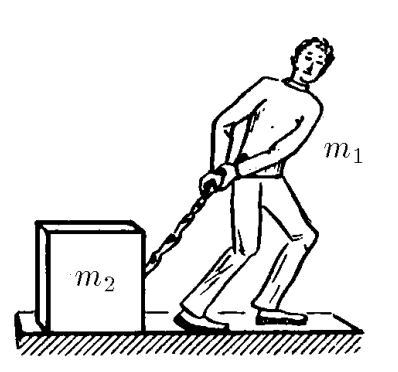
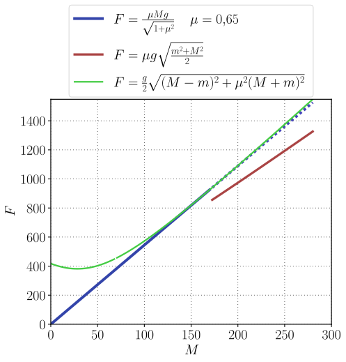
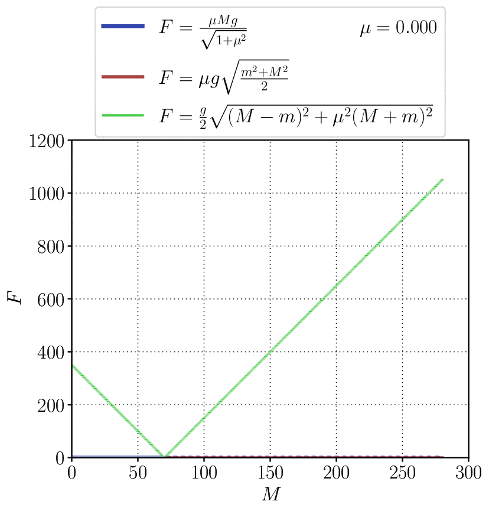

###  Условие:

$2.1.27^*.$ Человек массы $m_1$, оставаясь на месте, тянет за веревку груз массы $m_2$. Коэффициент трения о горизонтальную плоскость равен $\mu$. При какой наименьшей силе натяжения веревки груз стронется с места? Под каким углом к горизонтальной плоскости должна быть направлена веревка?

###  Решение:

###  Примечание:

Много где эта задача сформулирована без вопроса про угол, но с уточнением $m < M.$ Ответ в приводимых решениях получается сплошь и рядом совпадающим только с нашим случаем 2 (см. [1](https://reshimvse.com/zadacha.php?id=1631), [2](https://earthz.ru/solves/Zadacha-po-fizike-410), [3](https://fizmatbank.ru/tasks/decision/77500)).

Как мы выяснили, на самом деле это решение годится не для $m < M$, а для $m < M\frac{1-\mu^{2}}{1+\mu^{2}}.$ Кстати, в приведенных ссылках предлагается более короткий способ нахождения силы, поскольку он не предполагает нахождение оптимального угла.

Оценим, большая ли получается ошибка в диапазоне $M\frac{1-\mu^{2}}{1+\mu^{2}} < m < M.$

Красной линией на графике ниже показан ответ, указанный в задачнике Савченко — этот ответ не может быть верным, поскольку разрыва между синей и красной линией быть не должно. Синий пунктир для наглядности показывает поведение синей функции вне диапазона ее применимости, т.е. при $m < M\frac{1-\mu^{2}}{1+\mu^{2}}.$ Маленький разрыв в зеленой линии показывает принятое значение для $m=70\,$кг. Видно, что разница между зеленой кривой правее разрыва и синей сплошной не очень велика.

Чтобы понять, как меняется эта разница между зеленым и синим графиком с коэффициентом трения, можно взглянуть на следующий анимированный график. Придется потратить время, чтобы во всем разобраться, но следующее за этим просветление того стоит.

###  Ответ:

При $m\geqslant M\frac{1-\mu^{2}}{1+\mu^{2}}:$

$$
\alpha =\operatorname{\arctan }\mu ;
$$

$$
T = \frac{\mu Mg}{\sqrt{1+\mu^{2}}}
$$

При $m < M\frac{1-\mu^{2}}{1+\mu^{2}}:$

$$
\alpha = \mathrm{\arctan }\frac{m-M}{\mu (m+M)} ;
$$

$$
T= \frac{g}{2}\sqrt{\mu^{2}(m+M)^{2}+\left(m-M\right)^{2}}
$$