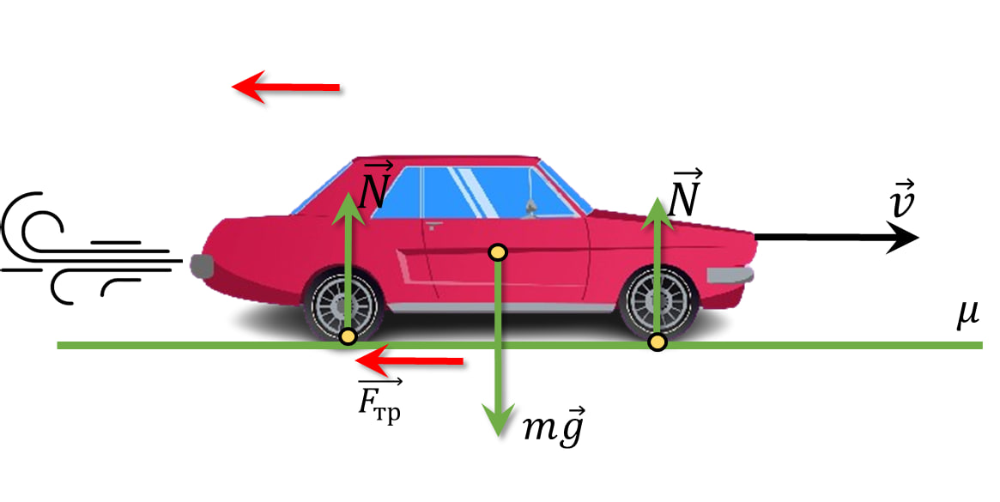

###  Условие:

$2.1.29.$ Автомобиль с мощным двигателем, трогаясь с места, за $5 \,с$ набирает скорость $72 \,км/ч$. Найдите коэффициент трения между колесами и дорогой. Каков наименьший тормозной путь автомобиля, набравшего эту скорость?

###  Решение:

Находим величину замедления

$$
a = -\frac{\Delta v}{\Delta t} = -4 \,\frac{м}{с}
$$

$$
\Delta t = \frac{\Delta v}{a}
$$

2\. Кинематические уравнения движения в данном случае представятся следующим образом

$$
\boxed{x=v_0t-\frac{v \Delta t^2}{2}=\frac{v_0^2}{2a}=50 \,м}
$$

Найдем Коэфицент трения $\mu$:

$$
ma = \mu mg
$$

$$
\boxed{\mu = \frac{a}{g} = 0.4}
$$

#### Ответ:

$$
\mu\approx 0.4\text{; }l \approx 50 \text{ м}
$$