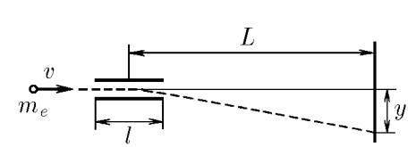

###  Условие: 

$2.1.3.$ В электронно-лучевой трубке электроны с начальной горизонтальной скоростью $v$ влетают в область электрического поля протяженности $l$, где на них действует вертикальная сила со стороны заряженных отклоняющих пластин. Чему равна эта сила, если электроны, попадая на экран, смещаются на расстояние $y$ по сравнению со случаем незаряженных пластин? Экран находится на расстоянии $L$ от центра области действия электрической силы. Масса электрона $m_е$. 

###  Решение: 

Электрическая сила сообщает электрону ускорение $$a = \frac{F_{эл}}{m_e}$$ где $a = \frac{v_y – v_{0y}}{t}\text{, т.к. }v_{0y} = 0$ – электрон влетает перпендикулярно экрану, то $$\frac{v_y}{t} = \frac{F_{эл}}{m_e}\text{, и }F_{эл} = \frac{m_ev_y}{t}\tag{1}$$ Здесь $v_y$ – вертикальная составляющая скорости, которую приобретет электрон при вылете из пластин. Для определения электрической силы требуется найти вертикальную скорость и время движения электрона до вылета из пластин. Скорость определим из условия $$y = \frac{at^2}{2} = \frac{v_y t^2}{2t} = \frac{v_y t}{2},$$ $$v_y = \frac{2y}{t}\text{, где }t = \frac{l}{v},\tag{2}$$ следовательно, вертикальная составляющая скорости $$v_y = \frac{2yv}{l}\tag{3}$$ Подставляя $(2)$ и $(3)$ в $(1)$, получим $$F_{эл} = \frac{2ym_ev^2}{l^2}\tag{4}$$ После вылета из пластин, электрон далее движется по инерции. Тангенс угла, под которым летит электрон к горизонтали, после вылета из пластин, равен $$\tan\alpha = \frac{v_y}{v} = \frac{2y}{vt} = \frac{2y}{l}$$ С другой стороны $$\tan\alpha = \frac{Y - y}{L – l/2} = \frac{2(Y - y)}{2L - l}$$ Тогда $$\frac{2y}{l} = \frac{2(Y - y)}{2L - l}$$ После несложных преобразований находим $$y = \frac{Yl}{2L}.\tag{5}$$ Сделаем подстановку $(5)$ в $(4)$ и найдем ответ на вопрос $$F_{эл} = \frac{2m_ev^2}{l^2}\frac{Yl}{2L} = \frac{m_eYv^2}{lL}$$ 

####  Ответ: 

$$\fbox{$F_{эл} = \frac{m_eYv^2}{lL}$}$$

  

