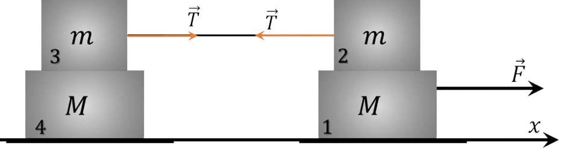

###  Условие:

$2.1.31.$ На гладком горизонтальном столе расположена система грузов, изображенная на рисунке. Правый нижний груз тянут вдоль стола с силой $F$, как указано на рисунке. Коэффициент трения между грузами массы $m_1$ и $m_2$ равен $\mu$. Найдите ускорение всех грузов системы.

###  Решение:

Перенумеруем грузы так, как показано на рисунке, и ось $X$ направим вправо.

Ясно, что тогда ни один из грузов не может иметь отрицательного ускорения.

Докажем что грузы $3$ и $4$ движутся как одно целое. Для этого предположим противное: пусть груз $3$ скользит по грузу $4$. Тогда между ними возникает сила трения

$$
F_{тр}= \mu mg
$$

а в нити возникает сила упругости

$$
T> \mu mg
$$

При этом ускорение груза $2$ было бы направлено влево, чего не может быть. Следовательно, ускорения грузов $2$, $3$ и $4$ одинаковы.

Обозначим ускорение этих грузов через $\bar{a}_{1}=\bar{a}_{2}$, а ускоренbе груза $1$ через $\bar{a}_{1}$.

Теперь рассмотрим два случая.

Случай 1. Пусть грузы $1$ и $2$ находятся в относительном покое и $\bar{a}_{1}=\bar{a}_{2}$.

Обозначим модуль силы трения покоя между ними через $F_1$ -модуль силы трения между грузами $3$ и $4$ через $F_2$ и модуль силы упругости нити через $T$ .

Тогда: для груза $1$

$$
F-F_{1}=Ma_{1}
$$

для груза $2$

$$
F_{1}-T=ma_{2}
$$

для груза $3$

$$
T-F_{2}=ma_{2}
$$

для груза $4$

$$
F_{2}=Ma_{2}
$$

Решая эту систему уравнений, получаем:

$$
F_{1}=\frac{2m+M}{2(M+m)}F,a_{1}=a_{2}=\frac{F}{2(M+m)}
$$

Этот же результат можно получить и другим путем. Так как трение между всеми поверхностями является трением покоя, то система грузов движется как одно тело с массой $M=2(M+m)$.

Поэтому

$$
\bar{F}=m \bar{a}_{1},\bar{a}_{1}=\bar{a}_{2}= \frac{\bar{F}}{2(M+m)}
$$

Случай $2$.

Пусть груз $2$ скользит то грузу $1$. Тогда на груз $1$ действует сила трения

$$
F_{тр}^{\prime}= \mu mg
$$

и этот груз получает ускорение $a_{1}=\frac{F- \mu mg}{m}$.

Система грузов $2$, $3$ и $4$ движется как одно тело, масса которого $M_{0}=2m+M$ с ускорением

$$
a_{2}=\frac{\mu mg}{2m+M}
$$

Первый случай реализуется, если

$$
F \geq \frac{2 \mu m (m+M)g}{2m+M}
$$

#### Ответ:

При $F\leqslant\frac{2\mu m_{1}g(m_{1}+m_{2})}{m_{2}+2m_{1}}\equiv F_{0}$ получаем $a_{1\text{пев}}=a_{1\text{прав}}=a_{2\text{прав}}=\frac{F}{2(m_{1}+m_{2})}$

При $F\geqslant F_{0}$ получаем $a_{2\text{прав}}=\frac{F-\mu m_{1}g}{m_{2}}$, $a_{1\text{лев}}=a_{1\text{прав}}=a_{2\text{лев}}=\frac{\mu m_{1}g}{m_{2}+2m_{1}}$