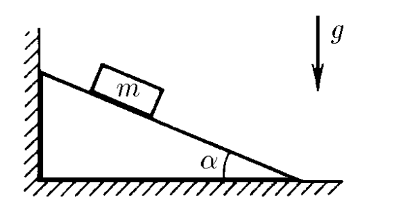

###  Условие: 

$2.1.32.$ Определите силу, действующую на вертикальную стенку со стороны клина, если на него положили груз массы $m$. Угол при основании клина $\alpha$. Коэффициент трения между грузом и поверхностью клина $\mu$. Трения между полом и клином нет. 

###  Решение: 

Возникновение действия на клин со стороны мела обусловлено ускоренным движением тела по клину 

Движение становится возможным при условии $$mg \sin\alpha\geq \mu mg \cos\alpha$$ в противном случае тело будет покоиться, и ускорение не возникнет. 

Используя принципы освобождаемости, представим тело как свободную материальную частицу, находящуюся под действием системы сил $\\{mg; F_\tau\\}$ 

Уравнение второго закона Ньютона в проекции на направление движения тела представится следующим образом: $$ma_x=mg \sin\alpha - \mu mg \cos\alpha$$ $$a_x=g \sin\alpha - \mu g \cos\alpha$$ Сила, действующая на клин и вертикальную стенку $$F = mg \cos\alpha (\sin\alpha - \mu\cos\alpha )$$ 

###  Ответ: 

$F=mg\operatorname{\cos}\alpha (\operatorname{sin}\alpha -\mu\operatorname{\cos}\alpha )$ при $\mu\leqslant\operatorname{tg}\alpha$; 

$F=0$ при $\mu\geqslant\operatorname{tg}\alpha$ 
