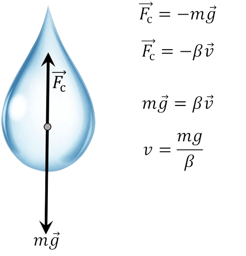

###  Условие:

$2.1.33.$ Почему скорость дождевых капель не зависит от высоты туч и сильно зависит от размеров капель?

###  Решение:

На падающую каплю действуют две силы: постоянная сила тяжести, ускоряющая движение капли, и сила сопротивления воздуха, замедляющая ее движение и растущая с ростом скорости капли. Сила сопротивления воздуха растет до тех пор, пока она не стапет равной силе тяжести. Дальше прекращается изменение скорости, и падение капель происходит с постоянной скоростью.

При увеличений размеров капли сила тяжести увеличивается пропорционально объему, т. е. пропорционально третьей степени радиуса, а сила сопротивления - пропорционально сечению капли, т. е. пропорционально квадрату радиуса. Поэтому при увеличении радиуса капли сила тяжести увеличивается быстрее, чем сила сопротивления воздуха, а значит и та постоянная скорость, с которой капля падает на землю, растет по мере увеличения размеров капли.