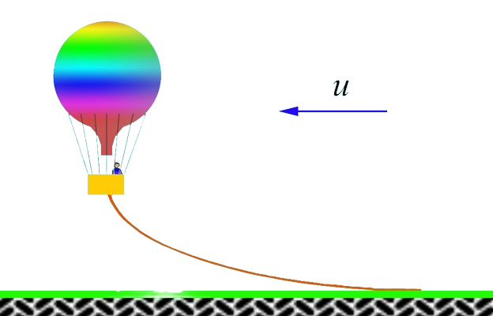
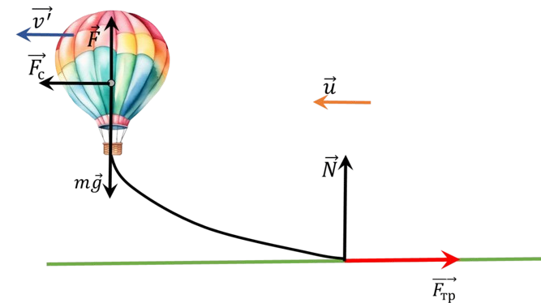

###  Условие: 

$2.1.35^*.$ Масса воздушного шара вместе с канатом, волочащимся по земле, равен $m$; выталкивающая сила, действующая на шар, равна $F$; коэффициент трения каната о землю равен $\mu$. Сила сопротивления воздуха, действующая на воздушный шар, пропорциональна квадрату скорости шара относительно воздуха: $f = \alpha v^2$. Найдите скорость шара относительно земли, если дует горизонтальный ветер со скоростью $u$. 

###  Решение: 

  Силы действующие на воздушный шар 

На шар действуют пять сил (см. рис.): сила тяжести $\vec{F}_{т} = M \vec{g}$, выталкивающая сила $\vec{F}$, сила сопротивления воздуха $\vec{F}_{c}$, сила реакции Земли $\vec{N}$ и сила трения со стороны Земли $\vec{F}_{тр}$. 

Обозначим через $\vec{v}^{ \prime}$ скорость шара относительно Земли. Тогда $$\vec{F}_{c} = - \alpha ( \vec{v}^{ \prime} - \vec{u})$$ Из условия, что воздушный шар движется равномерно в горизонтальном направлении, следует $$| \vec{F}_{c} | - | \vec{F}_{тр} | = 0$$ $$| \vec{F}| + | \vec{N}| - M | \vec{g} | = 0$$ Кроме того, $$| \vec{F}_{тр} | = \mu | \vec{N} |$$ С учетом того, что $$| \vec{F}_{c}| = - \alpha ( | \vec{v}^{ \prime} | - | \vec{u} | )$$ из последних трех уравнений получим $$| \vec{v}^{ \prime} | = | \vec{u} | - \frac{ \mu}{ \alpha} (M | \vec{g} | - | \vec{F} | )$$ 

###  Ответ: 

$v = u − \sqrt{(\mu /\alpha )(mg − F)}$ при $\alpha u^2 \geq \mu (mg − F)$, иначе $v = 0$ 

###  Альтернативное решение: 

 
