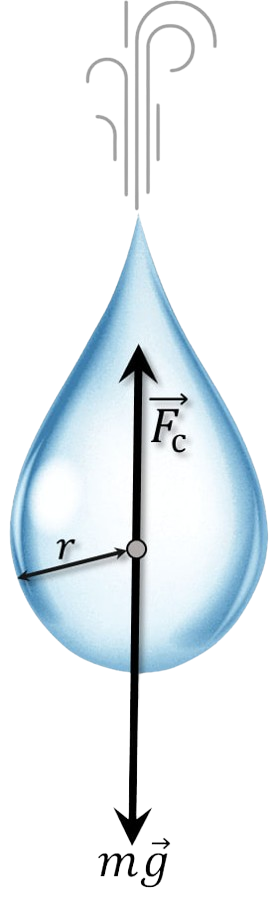

###  Условие:

$2.1.37.$ Сила сопротивления воздуха, действующая на капли дождя, пропорциональна произведению квадрата скорости капель на квадрат их радиуса: $f = A\rho_0r^2v^2$, где $\rho_0 \approx 1.3 \,кг/м^3$ — плотность воздуха, а безразмерный коэффициент $A$ для круглых капель порядка $1$.

Какие капли, крупные или мелкие, падают на землю с большей скоростью?

Оцените скорость капли радиуса $r = 1 \,мм$ при падении ее с большой высоты.

###  Решение:

На падающую каплю действуют две силы: постоянная сила тяжести, ускоряющая движение капли, и сила сопротивления воздуха, замедляющая ее движение и растущая с ростом скорости капли. Сила сопротивления воздуха растет до тех пор, пока она не стапет равной силе тяжести. Дальше прекращается изменение скорости, и падение капель происходит с постоянной скоростью.

Запишем уравнение через длительный промежуток времени:

$$
mg=A\rho_0r^2v^2\tag{1}
$$

Найдем $m$ через объем $V$:

$$
m=\rho V=\frac{4}{3} \rho\pi r^3
$$

И подставим в $(1)$:

$$
\frac{4}{3} \rho\pi r^3 g=A\rho_0r^2v^2
$$

Отсюда:

$$
\boxed{v = \sqrt{\frac{4}{3} \rho\pi r g \cdot \frac{1}{A\rho_0}}\approx 5.5\,\frac{м}{с}}\tag{2}
$$

Из $(2)$, чем больше $r$, тем больше $v$. Значит, крупные капли падают на землю с большей скоростью

#### Ответ:

Крупные; $v \approx 5.5 \,м/с$