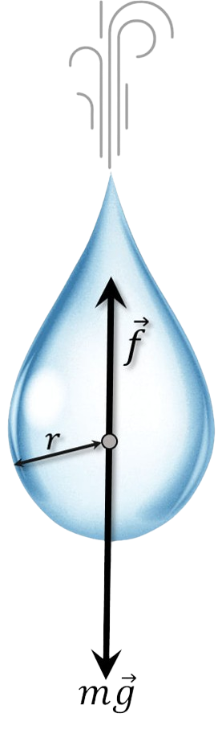

###  Условие:

$2.1.38.$ Сила сопротивления воздуха, действующая на капли тумана, пропорциональна произведению радиуса на скорость: $f = \gamma rv$. Капли радиуса $r = 0.1 \,мм$, падая с большой высоты, у земли имеют скорость около $1 \,м/с$. Какую скорость будут иметь капли, радиус которых в два раза меньше? в десять раз меньше?

Какие капли, крупные или мелкие, падают на землю с большей скоростью?

Оцените скорость капли радиуса $r = 1 \,мм$ при падении ее с большой высоты.

###  Решение:

На падающую каплю действуют две силы: постоянная сила тяжести, ускоряющая движение капли, и сила сопротивления воздуха, замедляющая ее движение и растущая с ростом скорости капли. Сила сопротивления воздуха растет до тех пор, пока она не стапет равной силе тяжести. Дальше прекращается изменение скорости, и падение капель происходит с постоянной скоростью.

Запишем уравнение через длительный промежуток времени:

$$
mg=\gamma rv\tag{1}
$$

Найдем $m$ через объем $V$:

$$
m=\rho V=\frac{4}{3} \rho\pi r^3
$$

И подставим в $(1)$:

$$
\frac{4}{3} \rho\pi r^3 g=\gamma rv
$$

Отсюда:

$$
v = \frac{4}{3} \frac{\rho\pi g}{\gamma} \cdot r^2 =\alpha r^2\tag{2}
$$

$$
\alpha = \frac{4}{3} \frac{\rho\pi g}{\gamma} =\frac{v}{r^2}=10^8 \,\frac{1}{м \cdot с}
$$

Подставлем и находим ответ

$$
v(\frac{r}{2}) = \alpha\frac{r^2}{4}=0.25\, м/с
$$

$$
v(\frac{r}{10}) = \alpha\frac{r^2}{100}=0.01\, м/с
$$

#### Ответ:

$$
v_1 \approx 0.25 \,м/с;
$$

$$
v_2 \approx 0.01 \,м/с
$$