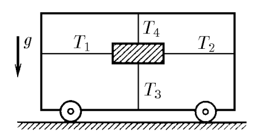
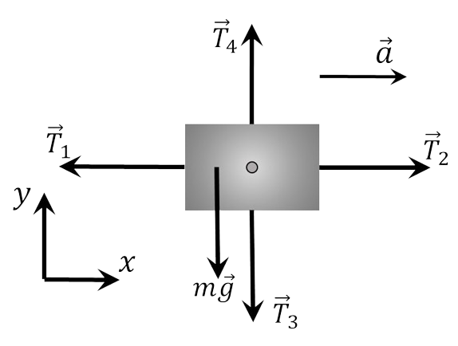

###  Условие:

$2.1.4.$ Четырьмя натянутыми нитями груз закреплен на тележке. Сила натяжения горизонтальных нитей соответственно $T_1$ и $T_2$, а вертикальных — $T_3$ и $T_4$. С каким ускорением тележка движется по горизонтальной плоскости?

###  Решение:

Второй закон Ньютона:

$$
\vec{T_1} + \vec{T_2} + \vec{T_3} + \vec{T_4} + m\vec{g}=m\vec{a}
$$

Запишем систему уравнений в проекциях на оси $Ox$ и $Oy$:

$$
\left\\{\begin{matrix} T_4-T_3=Mg & \\\ T_2-T_1=ma & \end{matrix}\right.
$$

Отсюда

$$
a = g \frac{T_2 − T_1}{T_4 − T_3}
$$

####  Ответ:

$$
\fbox{$a = g(T_2 − T_1)/(T_4 − T_3)$}
$$