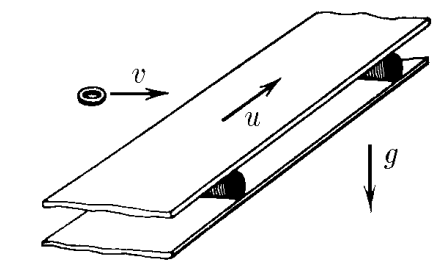

###  Условие: 

$2.1.40.$ Лента горизонтального транспортера движется со скоростью $u$. На ленту по касательной к ней влетает шайба, начальная скорость $v$ которой перпендикулярна краю ленты. Найдите максимальную ширину ленты, при которой шайба достигнет другого ее края, если коэффициент трения между шайбой и лентой $\mu$. 

###  Решение: 

  Движение шайбы по ленте 

1\. Ускорение шайбы определится уравнением второго закона Ньютона: $$\mu mg=ma$$ $$a=\mu g$$ 2\. При ширине ленты транспортёра $d$ шайба ввиду движения ленты пройдёт равнозамедленно расстояние $x$. Из подобия прямоугольных треугольников, полученных на векторах заданных скоростей и геометрических параметрах движения шайбы найдем соотношение: $$\frac{d}{x} =\frac{v}{v_0}$$ $$\frac{d}{x} =\frac{v}{\sqrt{v^2+u^2}}$$ $$d =x \frac{v}{\sqrt{v^2+u^2}}$$ 3\. Расстояние, проходимое шайбой $x$ найдём из кинематики: $$\left\\{\begin{matrix} v=v_0-at & \\\ x=v_0t-\frac{at^2}{2} & \end{matrix}\right.$$ $$v=0\Rightarrow t=\frac{v_0}{a}=\frac{\sqrt{v^2+u^2}}{\mu g}$$ $$x=\frac{v^2+u^2}{\mu g}-\frac{v^2+u^2}{2\mu g}=\frac{v^2+u^2}{2\mu g}$$ 4\. Подставим далее значение $x$ в уравнение для $d$ $$\boxed{d = v\frac{\sqrt{v^2+u^2}}{2\mu g}}$$ 

###  Ответ: 

$$d =\frac{v}{2\mu g} \sqrt{v^2+u^2}$$ 
