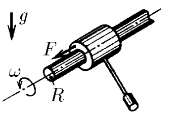

###  Условие:

$2.1.43^*.$ Горизонтальную ось радиуса $R$, вращающуюся с угловой скоростью $\omega$, обжимает втулка, снабженная противовесом, чтобы, перемещаясь вдоль оси, она не вращалась. Определите установившуюся скорость втулки под действием силы $F$, приложенной к ней вдоль оси. Максимальная сила трения оси о втулку $F_{тр} > F$.

###  Решение:

#### Ответ:

$$
v = \omega RF/\sqrt{F^2_{тр} − F_2}
$$