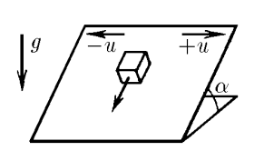
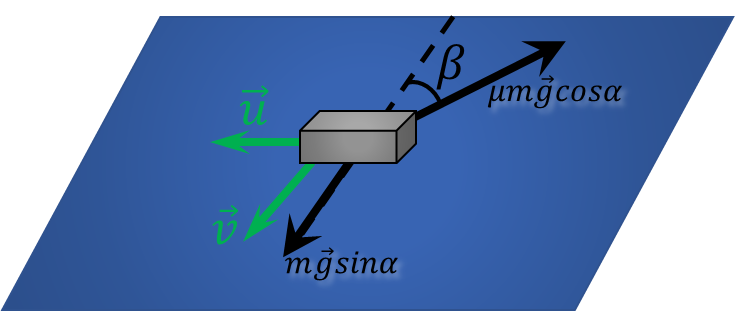

###  Условие: 

$2.1.44^*.$ Определите установившуюся скорость тела, находящегося на наклонной плоскости, которая с большой частотой меняет одно направление своей скорости $u$ на противоположное. Направление движения плоскости показано на рисунке. Коэффициент трения $\mu$, угол наклона плоскости $\alpha , \, \text{tg} \alpha < \mu .$ 

###  Решение: 

  Силы действующие на тело 

Т.к. скорость меняется быстро, то тело не успевает сдвинуться в горизонтальном направлении и всё время движется в направлении $\vec{v}$ 

Т.к. $v=\text{const}$, то в направлении вдоль скорости $\vec{v}$ отсутствует ускорение $$mg\sin\alpha = \mu mg \cos\alpha\cos\beta$$ $$\cos\beta = \frac{\tan\alpha}{\mu}$$ Из геометрических соображений модули векторов $\vec{v}$ и $\vec{u}$ связаны соотношением $$v=\frac{u}{\tan\beta}$$ $$v=u \frac{\frac{\tan\alpha}{\mu}}{\sqrt{1-\frac{\tan^2\alpha}{\mu^2}}}$$ $$\boxed{v = u \frac{\tan\alpha}{\sqrt{\mu^{2} − \tan^{2} \alpha}}}$$ 

###  Ответ: 

$$v = u \frac{\, \text{tg} \alpha}{\sqrt{\mu^{2} − \text{tg}^{2} \alpha}}$$ 

###  Альтернативное решение: 

 
