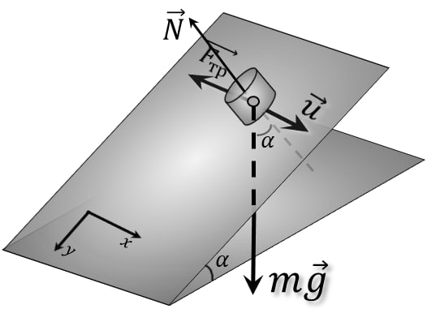
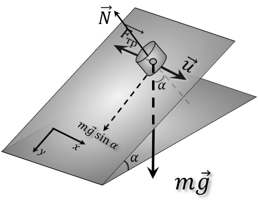
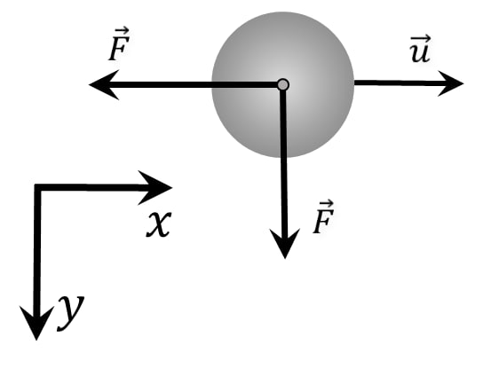
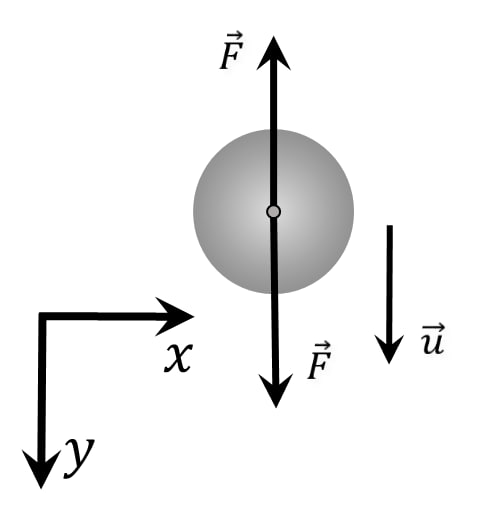
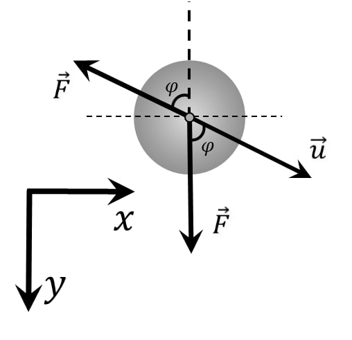

###  Условие:

$2.1.45^*.$ На плоскости, тангенс угла наклона которой равен коэффициенту трения, лежит монета. В горизонтальном направлении вдоль плоскости монете сообщили скорость $v$. Найдите установившуюся скорость монеты.

###  Решение:

Проектируем $m\vec{g}$ на $OY$:

Из рисунка, найдем силу реакции опоры:

$$
N=mg \cos\alpha
$$

По Закону Амонтона — Кулона:

$$
F_{тр}=\mu N=\mu mg \cos\alpha
$$

Т.к. $\mu = \tan\alpha$ (по условию):

$$
F_{тр}=\mu mg \cos\alpha
$$

$$
F_{тр}=mg \cdot \tan\alpha\cdot \cos\alpha =mg \sin\alpha
$$

$$
F=mg \sin\alpha
$$

Перерисуем в плоскости $XY$ В начальный момент $(\varphi=90^{\circ})$:

В конечный момент $(\varphi=0^{\circ})$:

Рассмотрим, произвольный момент:

Заметим, что $\varphi$ меняется от $0^{\circ}$ до $90^{\circ}$:

Запишем второй закон Ньютона:

$$
\left\\{\begin{matrix} \frac{du_x}{dt} = \frac{F \sin \varphi }{m}& \\\ \frac{du_y}{dt} = \frac{F (1- \cos \varphi) }{m} & \end{matrix}\right.
$$

$$
\left\\{\begin{matrix} \frac{d}{dt} (u \sin\varphi)= \frac{F \sin \varphi }{m}& \\\ \frac{d}{dt} (u \cos\varphi) = \frac{F (1- \cos \varphi) }{m} & \end{matrix}\right.
$$

Решаем систему дифференциальных уравнений:

$$
\left\\{\begin{matrix} \frac{d\varphi}{dt} = \frac{F \sin \varphi }{mu}& (a)\\\ \frac{du}{dt} = \frac{F (1- \cos \varphi) }{m} & (b) \end{matrix}\right.
$$

Разделим $(b)$ на $(a)$:

$$
\frac{du}{d\varphi} = u\frac{1- \cos \varphi}{\sin \varphi}
$$

$$
\frac{du}{u} = \frac{1- \cos \varphi}{\sin \varphi} d\varphi
$$

$$
\frac{du}{u} = tg (\frac{\varphi}{2}) d\varphi
$$

Интегрируем обе части уравнения:

$$
\int \frac{du}{u} = \int tg (\frac{\varphi}{2}) d\varphi \tag{c}
$$

$$
\int\frac{du}{u}=ln|u| \tag{d}
$$

$$
\int tg (\frac{\varphi}{2}) d\varphi=-2 ln(\cos(\frac{x}{2})) \tag{e}
$$

Подставляем $(e)$ и $(d)$ в $(c)$:

$$
ln(v)+C=ln(\sin(\varphi)) -(ln(\sin(\frac{\varphi}{2})-\cos(\frac{\varphi}{2})))\tag{e}
$$

$$
v_x=\frac{v}{2}
$$

#### Ответ: $v/2$