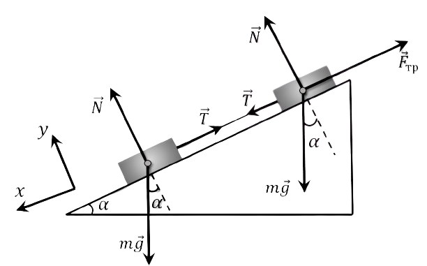

###  Условие:

$2.1.46.$ По наклонной плоскости скользят два тела одинаковой массы, связанные нитью. Сила натяжения нити $T$. Трения между одним телом и доской нет. Определите силу трения между доской и другим телом.

###  Решение:

1\. Поскольку тела одинаковой массы движутся вниз по плоскости при натянутой нити, то шероховатой поверхностью будет обладать верхнее тело. Тела при натянутой нити будут иметь одинаковые ускорения.

2\. Запишем уравнения второго закона Ньютона в проекции на направление движения для каждого тела в отдельности:

$$
\left\\{\begin{matrix} m_1g\,\sin\alpha -T=m_1a_1 & \\\ m_1g\,\sin\alpha +T-F_т=m_2a_2 & \end{matrix}\right.
$$

$$
a_1=a_2
$$

$$
m_1=m_2
$$

$$
mg\,\sin\alpha +T-F_т=mg\,\sin\alpha -T
$$

$$
F_т=2T
$$

###  Ответ:

$$
F = 2T
$$