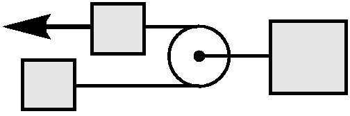

###  Условие:

$2.1.47^*.$ Найдите ускорение тел системы, изображенной на рисунке. Сила $F$ приложена по направлению нити к одному из тел массы $m$. Участки нити по обе стороны от легкого блока, прикрепленного к телу массы $M$, параллельны

###  Решение:

Тело массой $m_3$ движется с ускорения центра масс системы

Рассматривая систему целиком(не учитывая внутренних сил)

$$
\boxed{a_3 = \frac{F}{M+2m}}
$$

При этом на тело $m_3$ действует сила, эквивалентная двойной силе натяжения нити $2T$

$$
2T = M a_3
$$

$$
T = F\frac{M}{2(M+2m)}
$$

На тело $m_1$ действует две силы $\vec{T}$ и $\vec{F}$

Второй закон Ньютона для первого тела запишем как

$$
F-T = ma_1
$$

$$
\boxed{a_1=\frac{F(M+4m)}{2m(M+2m)}}
$$

Аналогично, на второе тело $m_2$ действует только $\vec{T}$

$$
m_2 = T
$$

$$
\boxed{a_2=\frac{FM}{2m(M+2m)}}
$$

#### Ответ:

Ускорения грузов 1–3:

$$
a_1=\frac{F(M+4m)}{2m(M+2m)}
$$

$$
a_2=\frac{FM}{2m(M+2m)}
$$

$$
a_3=\frac{F}{M+2m}
$$

###  Альтернативное решение:

