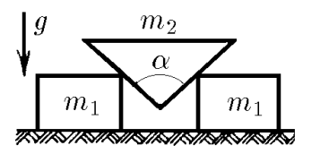
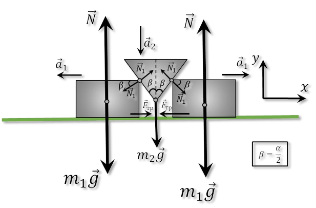
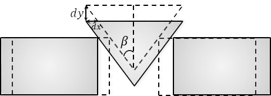

###  Условие:

$2.1.48.$ Между двумя одинаковыми гладкими брусками массы $m_1$ каждый вставлен клин массы $m_2$ с углом $\alpha$. Определите ускорение тел.

###  Решение:

Рассмотрим малое смещение за время $dt$ с точки зрения кинематики:

Из геометрических соображений:

$$
dy = dx \cdot c\tan\beta
$$

Продеффиринцируем дважды обе части выражения:

$$
\frac{dy}{d^2t} = \frac{dx}{d^2t} \cdot c\tan\beta
$$

$$
a_1 = a_2 \cdot \tan\beta\tag{1}
$$

Т.к. Автор не сказал ничего про трение, пример $F_{тр}=0$ Далее, запишем 2 закон Ньютона для бруска $m_1$ на ось $OY$:

$$
m_1a_1=N_1\cos\beta
$$

$$
N_1=\frac{m_1a_1}{\cos\beta}\tag{a}
$$

Аналогично для $m_2$:

$$
m_2a_2=m_2g-2N_1\,\sin\beta\tag{b}
$$

Подставляем $(a)$ в $(b)$:

$$
m_2a_2=m_2g-2m_1a_1\cdot \tan\beta
$$

Подставляем $(1)$ в $(c)$:

$$
m_2a_2=m_2g-2m_1a_2\cdot \tan^2\beta
$$

Выражаем $a_2$:

$$
\boxed{a_2=\frac{m_2g}{m_2+2m_1\,\tan^2\beta}}\tag{d}
$$

Учитывая $(1)$, домнажаем $(d)$ на $\tan\beta$:

$$
\boxed{a_1=\frac{m_2g\,\tan\beta}{m_2+2m_1\,\tan^2\beta}}
$$

###  Ответ:

$$
a_1=\frac{m_2g\,\tan\beta}{m_2+2m_1\,\tan^2\beta}
$$

$$
a_2=\frac{m_2g}{m_2+2m_1\,\tan^2\beta}
$$

###  Примечание:

Попробуйте объяснить парадокс:

Опишем движение центра масс системы на ось $OY$:

$$
(2m_1+m_2)a_y=2m_1\vec{g}+m_2\vec{g}+2\vec{N}+2\vec{N_1}-2\vec{N_1}+\vec{F_{тр}}-\vec{F_{тр}}
$$

Т.к. $\vec{N_1}$ и $\vec{F_{тр}}$ — внутренние силы и компенсируют друг друга, a $\vec{N}$ компенсируют $m_1\vec{g}$

$$
(2m_1+m_2)a_y=m_2g
$$

$$
a_y=g\frac{m_2}{2m_1+m_2}
$$

Т.к. грузы массой $m_1$ лежат на поверхности $(y=const)$

$$
a_2=a_y=g\frac{m_2}{2m_1+m_2}\tag{2}
$$

Подставляем $(2)$ в $(1)$:

$$
a_1 = a_2 \cdot \tan\beta
$$

$$
a_2=g\frac{m_2 \,\tan\beta}{2m_1+m_2}
$$

Что не является ответом!