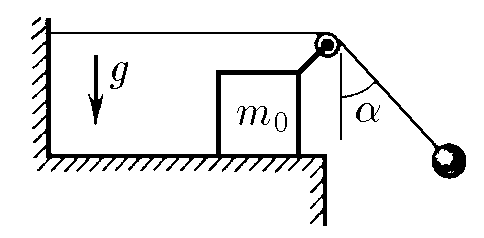
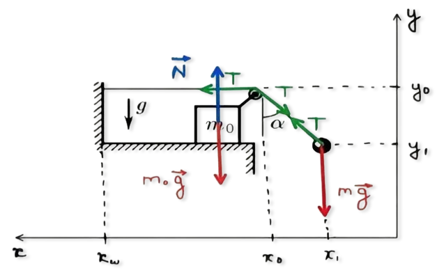

###  Условие:

$2.1.49^*.$ К свободному концу нити, прикрепленной к стенке и переброшенной через ролик, подвешен груз. Ролик закреплен на бруске массы $m_0$, который может скользить по горизонтальной плоскости без трения. В начальный момент нить с грузом отклоняют от вертикали на угол $\alpha$ и затем отпускают. Определите ускорение бруска, если угол, образованный нитью с вертикалью, не меняется при движении системы. Чему равна масса груза?

###  Решение:

Применим второй закон Ньютона:

$$
OX: \;T - T \sin\alpha = m_0 a_{0x}
$$

$$
T \sin\alpha = m_{a1x}
$$

$$
OY: \;N - mg - T \cos\alpha = m_0 a_{0y} = 0
$$

$$
T \cos\alpha - mg = m_{a1y}
$$

$$
\tan\alpha = \frac{x_0 - x_1}{y_0 - y_1}
$$

Учитывая $\alpha = \text{const}$

$$
\frac{d}{dt} \left( \tan\alpha\right) = \frac{\left( \frac{dx_0}{dt} - \frac{dx_1}{dt} \right)(y_0 - y_1) - \left( \frac{dy_0}{dt} - \frac{dy_1}{dt} \right)(x_0 - x_1)}{(y_0 - y_1)^2} = 0
$$

$$
\frac{d}{dt} \left( \left( \frac{dx_0}{dt} - \frac{dx_1}{dt} \right)(y_0 - y_1) \right) = \frac{d}{dt} \left( \left( \frac{dy_0}{dt} - \frac{dy_1}{dt} \right)(x_0 - x_1) \right)
$$

$$
\left(\frac{d^{2}x_{0}}{dt^{2}}-\frac{d^{2}x_{1}}{dt^{2}}\right)(y_{0}-y_{1})+\left(\frac{dx_{0}}{dt}-\frac{dx_{1}}{dt}\right)\left(\frac{dy_{0}}{dt}-\frac{dy_{1}}{dt}\right)=
$$

$$
\left(\frac{d^{2}y_{0}}{dt^{2}}-\frac{d^{2}y_{1}}{dt^{2}}\right)(x_{0}-x_{1})+\left(\frac{dy_{0}}{dt}-\frac{dy_{1}}{dt}\right)\cdot\left(\frac{dx_{0}}{dt}-\frac{dx_{1}}{dt}\right)
$$

$$
(a_{0x} - a_{1x})(y_0 - y_1) = (a_{0y} - a_{1y})(x_0 - x_1)
$$

$$
\tan\alpha (a_{0y} - a_{1y}) = a_{0x} - a_{1x}
$$

Из $(1)$

$$
a_{0y} = 0
$$

$$
-\tan\alpha\, a_{1y} = a_{0x} - a_{1x}
$$

Длина веревки:

$$
L = x_w - x_0 + \frac{y_0 - y_1}{\cos\alpha}
$$

Т.к. нить нерастяжима

$$
\frac{d^2 L}{dt^2} = -\frac{d^2 x_0}{dt^2} + \frac{1}{\cos\alpha} \left( \frac{d^2 y_0}{dt^2} - \frac{d^2 y_1}{dt^2} \right) = 0
$$

$$
\left( \frac{d^2 x_0}{dt^2} = a_{0x}, \frac{d^2 y_0}{dt^2} = a_{0y}, \frac{d^2 y_1}{dt^2} = a_{1y} \right)
$$

$$
a_{0x} \cdot \cos\alpha = a_{0y} - a_{1y}
$$

Из $(1)$: $a_{0y} = 0$

$$
a_{0x} \cos\alpha = -a_{1y}
$$

Разделив уравнения из $(1)$:

$$
\frac{T \sin\alpha}{T \cos\alpha} = \frac{m a_{1x}}{m (g + a_{1y})} \to \tan\alpha (g + a_{1y}) = a_{1x}
$$

$$
\tan\alpha a_{1y} = a_{1x} - g \tan\alpha
$$

и используя $(4)$

$$
\boxed{a_{0x} = g \tan\alpha}
$$

Разделив уравнения из $(1)$:

$$
\frac{T(1 - \sin\alpha )}{T \cos\alpha} = \frac{M}{m} \cdot \frac{a_{0x}}{g + a_{1y}}
$$

Обратите внимание, что:

$$
a_{1y} = -g \sin\alpha
$$

$$
\frac{1 - \sin\alpha}{\cos\alpha} \frac{M}{m} = \frac{g \tan\alpha}{g - g \sin\alpha} \to m = \frac{M \sin\alpha}{(1 - \sin\alpha )^2}
$$

$$
\boxed{m = \frac{M \sin\alpha}{(1 - \sin\alpha )^2}}
$$

###  Ответ:

$$
a = g \tan\alpha
$$

$$
m = m_0 \frac{\sin\alpha}{(1 − \sin\alpha )^2}
$$

###  Альтернативное решение:

